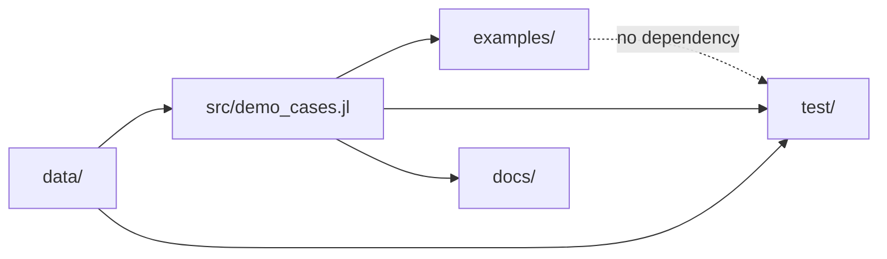
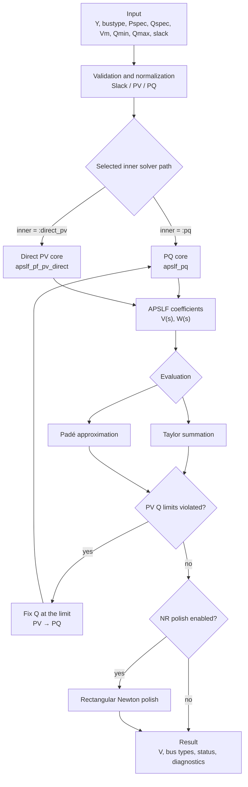

# AnalyticLoadFlow.jl – Architecture Overview

## 1. Overall System
Repository: https://github.com/SOPTIM/AnalyticLoadFlow.jl

### Architectural Boundary

APSLF operates on an already constructed Y-bus matrix. The public minimal interface is therefore intentionally independent of external grid formats:

```text
External grid format
        ↓  not part of AnalyticLoadFlow.jl
Conversion into Y + case vectors
        ↓
APSLF data model
        ↓
Solver
```

### Dependency Direction



### Basic Call Path

```text
User / application
        ↓
Examples or direct Julia call
        ↓
Case data: Y, bus types, powers, voltages, Q limits
        ↓
APSLF solver API
        ↓
Series computation and evaluation
        ↓
optional Q-limit switching and Newton polish
        ↓
Result, diagnostics, and console output
```

---

## 2. Public Interface

### Role of `src/AnalyticLoadFlow.jl`

`src/AnalyticLoadFlow.jl` is the central module and API entry point:

- defines the `AnalyticLoadFlow` module,
- loads the implementation files,
- exposes the supported functions as a public API,
- separates the preferred high-level entry point from older and specialized solver paths.

Included core modules:

```julia
include("solver_core.jl")
include("yamlparams.jl")
include("utils.jl")
include("line_flows.jl")
include("demo_cases.jl")
```

### Solver Entry Points

| Function | Role | Classification |
|---|---|---|
| `solve_pf_apslf` | Preferred high-level entry point | publicly exported |
| `solve_pf_apslf_with_pv_q_limits` | Solver with outer PV/Q-limit handling | specialized, module-qualified entry point |
| `apslf_pq` | APSLF core for the PQ formulation | lower-level solver path |
| `apslf_pf_pv_direct` | Direct PV formulation | specialized solver path |

For new applications, the current high-level interface should be used where possible. The specialized functions are mainly relevant for experiments, demos, and targeted solver control.

### Typical Solver Call

```julia
using AnalyticLoadFlow

spec = (
    Y = Y,
    bustype = bustype,
    Pspec = Pspec,
    Qspec = Qspec,
    Vm = Vm,
    Qmin = Qmin,
    Qmax = Qmax,
    slack = slack,
)

res = AnalyticLoadFlow.solve_pf_apslf(
    spec;
    mode = :direct,
    order = 40,
    use_pade = true,
    nr_polish = true,
)
```

Important result fields, depending on the solver path, include:

```text
V                computed complex bus voltages
converged        convergence status
bustype          effective bus types after Q-limit handling
outer_iters      number of outer PV/Q-limit steps
switch_log       logged PV→PQ switches
Vcoeff           series coefficients, if requested
```

---

## 3. Y-Bus Data Model

The examples use a compact `NamedTuple` as the case interface:

```julia
case = (
    Y = Y,
    bustype = bustype,
    Pspec = Pspec,
    Qspec = Qspec,
    Vm = Vm,
    Qmin = Qmin,
    Qmax = Qmax,
    slack = slack,
)
```

| Field | Meaning |
|---|---|
| `Y` | Complex bus-admittance matrix of the network |
| `bustype` | Bus type per node: `:slack`, `:pv`, or `:pq` |
| `Pspec` | Specified active-power injection in pu |
| `Qspec` | Specified reactive-power injection in pu |
| `Vm` | Voltage setpoints or reference magnitudes |
| `Qmin` | Lower reactive-power limit of a PV bus |
| `Qmax` | Upper reactive-power limit of a PV bus |
| `slack` | Index of the slack or reference bus |

Optional fields of the demo cases:

```text
labels        readable bus names
baseMVA       power base
reference_V   optional reference voltages
nbus          number of buses
metadata      topology or generation information
```

---

## 4. Directory and File Structure

```text
AnalyticLoadFlow/
├── src/
│   ├── AnalyticLoadFlow.jl
│   ├── solver_core.jl
│   ├── demo_cases.jl
│   ├── utils.jl
│   ├── line_flows.jl
│   └── yamlparams.jl
│
├── data/
│   ├── synthetic_118_case.jl
│   └── lv_400v_streets_case.jl
│
├── examples/
│   ├── minimal_ybus_demo.jl
│   ├── synthetic_118_ybus_demo.jl
│   ├── lv_400v_streets_ybus_demo.jl
│   └── tiled_grid_scaling_demo.jl
│
├── test/
│   ├── runtests.jl
│   ├── test_solver_core.jl
│   ├── test_minimal_example.jl
│   └── test_performance.jl
│
├── docs/
│   ├── make.jl
│   └── src/
│       ├── api.md
│       ├── minimal_ybus_demo.md
│       └── theorie-eng.md
│
└── .github/
    └── workflows/
        └── ci.yml
```

### `src/` – Implementation

| File | Purpose |
|---|---|
| `src/AnalyticLoadFlow.jl` | Module definition, includes, and public exports |
| `src/solver_core.jl` | APSLF core, Taylor/Padé evaluation, PQ/PV handling, Q limits, and NR polish |
| `src/demo_cases.jl` | Reusable case builders and demo wrappers for examples and tests |
| `src/transformers.jl` | Branch model with ratio and phase shift, `build_ybus` (dense/sparse), branch flows, 9-bus PST case, regulated PST loop |
| `src/matpower_import.jl` | MATPOWER `.m` reader with transformer convention detection |
| `src/utils.jl` | Formatting, mismatch, stability, and logging helpers as well as tiled-grid builders |
| `src/line_flows.jl` | Branch power flows and aggregated line losses |
| `src/yamlparams.jl` | Helpers for parameter processing in configured runs |

### `data/` – Synthetic Grid Data

| File | Purpose |
|---|---|
| `data/synthetic_118_case.jl` | Generates a synthetic network with approximately 118 buses |
| `data/lv_400v_streets_case.jl` | Generates a synthetic radial 400 V street network |

The files contain no real grid data and no official benchmark cases.

### `examples/` – Thin Console Entry Points

| File | Purpose |
|---|---|
| `examples/minimal_ybus_demo.jl` | General integration example for multiple Y-bus cases |
| `examples/synthetic_118_ybus_demo.jl` | Direct entry point for the synthetic 118-bus case |
| `examples/lv_400v_streets_ybus_demo.jl` | Direct entry point for the synthetic LV street network |
| `examples/tiled_grid_scaling_demo.jl` | Parametric tiled grid with configurable bus count and timing measurement |
| `examples/pst_ybus_demo.jl` | Phase-shifting transformer: both embeddings, angle sweep, regulated PST |
| `examples/pegase_matpower_demo.jl` | PEGASE 2869 from a MATPOWER file (downloaded on first use), sparse solve, comparison with the stored state |

The example files should mainly:

1. parse arguments,
2. call an existing case builder,
3. start the solver,
4. print compact results.

The actual reusable logic remains in `src/` or `data/`.

### `test/` – Validation

| File | Purpose |
|---|---|
| `test/runtests.jl` | Entry point for the test suite |
| `test/test_solver_core.jl` | Numerical core functions and solver helpers |
| `test/test_minimal_example.jl` | Reusable demo cases and their solver paths |
| `test/test_performance.jl` | Small runtime and allocation smoke tests, not a formal benchmark suite |

### `docs/` – Public Documentation

| File | Purpose |
|---|---|
| `docs/make.jl` | Documenter.jl build |
| `docs/src/api.md` | API overview |
| `docs/src/minimal_ybus_demo.md` | Explanation of the Y-bus demos |
| `docs/src/theorie-eng.md` | English theory article |

### `.github/workflows/`

`ci.yml` runs package tests and compact CLI smoke tests. Large scaling runs do not belong in CI.

---

## 5. Solver Flowchart



---

## 6. Feature Matrix

| Feature | Status | Classification |
|---|---|---|
| PQ load flow | supported | APSLF PQ core |
| PV buses | supported | outer-loop PV handling and direct PV core |
| Q limits | supported with limitations | PV→PQ switching when `Qmin` or `Qmax` is violated |
| NR polish | optional | rectangular Newton method as post-processing |
| Taylor evaluation | supported | direct evaluation of the series solution |
| Padé evaluation | supported | rational continuation of the series solution |
| Sparse Y-bus | supported | sparse matrix for larger networks or the tiled grid |
| Line flows | supported | PI line flows and loss sums |
| 9-bus teaching case | included | PV, PQ, and Q-limit demonstration |
| Synthetic 118-bus case | included | integration-scale case, not the official IEEE 118 case |
| Synthetic LV network | included | radial 400 V PQ network, not a real grid |
| Parametric tiled grid | included | configurable bus count and timing measurement |
| MATPOWER/CGMES import | not included | no external import workflow |
| Transformers and phase shifters | supported | complex tap, both embeddings of theory Section 6.5, regulated PST outer loop |
| MATPOWER import | included | angle unit/sign and ratio convention detected from the stored solution |
| Transformer tap/OLTC control | not included | no industrial control logic |
| GUI, web API, or service | not included | pure Julia library plus console examples |
| Formal benchmark suite | not included | timing demo and smoke tests are not a benchmark commitment |
| Commercial support/productization | not included | reference implementation |
