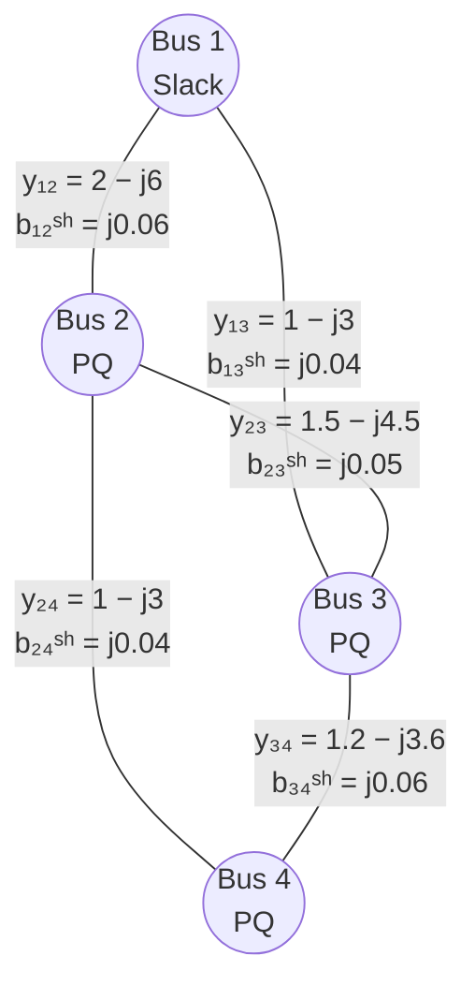

Company: SOPTIM
Version: 1.7
Date: 2026-09-17
Title: Analytical Power Series Load Flow (APSLF)
Author: Dipl.-Ing. Udo Schmitz
Reviewer: Dr. K. F. Schäfer

> *"This text was developed with technical assistance and subsequently reviewed and refined."*

> **Revision note (1.7):** The embedding now uses the reflected reciprocal $\widetilde{W}(s)=1/V^*(s^*)$ (reflection condition), see Section 2.4. Earlier versions used $W(s)=1/V(s)$ directly on the right-hand side, which solves $V \odot (YV) = S^*$ instead of the physical $\overline{V} \odot (YV) = S^*$. All numerical examples in Section 7 were recomputed; the 4-bus loads were halved because the original loads exceed the loadability limit of that network.

> **Notation:** A bar denotes the complex conjugate: for $z = a + jb$, $\overline{z} = a - jb$ (same magnitude, negated angle). The star $S^*$ means the same thing and is used for the conjugate power, as is customary in load-flow literature: $S^* = \overline{S} = P - jQ$. The only exception is $V^*(s^*)$ in Section 2.4, which denotes the reflected function $\overline{V(\bar{s})}$ and is defined there. All quantities are per unit; $j$ is the imaginary unit.

> **License notice:** The AnalyticLoadFlow.jl repository, including source code and documentation, is made available under the Apache-2.0 license unless explicitly stated otherwise. Patent and trademark notes in this article are informational cautions only and are not legal advice.

---

## Table of Contents

- [Analytical Power Series Load Flow (APSLF)](#analytical-power-series-load-flow-apslf)
  - [1. Motivation](#1-motivation)
  - [Patent Notice](#patent-notice)
  - [2. Basic Idea](#2-basic-idea)
    - [2.1 Starting Point: The Load-Flow Equations](#21-starting-point-the-load-flow-equations)
    - [2.2 Embedding Parameter $s$](#22-embedding-parameter-s)
    - [Trivial Starting Point $s=0$](#trivial-starting-point-s0)
    - [Physical Operating Point $s=1$](#physical-operating-point-s1)
    - [Analytical Meaning of $s$](#analytical-meaning-of-s)
    - [Role of Parameter $s$](#role-of-parameter-s)
    - [2.3 Holomorphic Voltage Functions](#23-holomorphic-voltage-functions)
      - [Aside: Meaning of the Term *holomorphic*](#aside-meaning-of-the-term-holomorphic)
    - [2.4 Treatment of Complex Conjugation](#24-treatment-of-complex-conjugation)
      - [Why is Complex Conjugation not Holomorphic?](#why-is-complex-conjugation-not-holomorphic)
      - [The Reflection Condition: Closing the Embedding](#the-reflection-condition-closing-the-embedding)
  - [3. Equations for PQ Buses](#3-equations-for-pq-buses)
  - [4. Recursion Formulas and Linearity per Order](#4-recursion-formulas-and-linearity-per-order)
    - [4.1 Constraint (Convolution)](#41-constraint-convolution)
    - [4.2 Network Equation (Linear System)](#42-network-equation-linear-system)
  - [5. Evaluation at $s = 1$](#5-evaluation-at-s--1)
    - [5.1 Convergence Radius](#51-convergence-radius)
    - [5.2 Padé Approximation: From Series to Quotient](#52-padé-approximation-from-series-to-quotient)
    - [5.3 Properties and Practical Use](#53-properties-and-practical-use)
  - [6. Practical Treatment of PV Buses](#6-practical-treatment-of-pv-buses)
    - [6.1 Problem Statement](#61-problem-statement)
    - [6.2 Outer-Loop Approach](#62-outer-loop-approach)
    - [6.3 Direct PV Formulation (Augmented Real System)](#63-direct-pv-formulation-augmented-real-system)
      - [Key idea: per order, solve one augmented real linear system](#key-idea-per-order-solve-one-augmented-real-linear-system)
      - [Network equations (PV and PQ)](#network-equations-pv-and-pq)
      - [PV voltage-magnitude constraint as an order-wise real equation](#pv-voltage-magnitude-constraint-as-an-order-wise-real-equation)
      - [Practical notes (implementation-oriented)](#practical-notes-implementation-oriented)
    - [6.4 Optional Newton Polishing (Rectangular Coordinates)](#64-optional-newton-polishing-rectangular-coordinates)
      - [Rectangular state vector](#rectangular-state-vector)
      - [Mismatch equations (PQ and PV)](#mismatch-equations-pq-and-pv)
      - [Analytic Jacobian in rectangular form (high level)](#analytic-jacobian-in-rectangular-form-high-level)
      - [NR update](#nr-update)
      - [Position in the overall solver](#position-in-the-overall-solver)
    - [6.5 Transformers and Phase Shifters](#65-transformers-and-phase-shifters)
  - [7. Numerical Example: 4-Bus Network with π-Model Lines](#7-numerical-example-4-bus-network-with-π-model-lines)
    - [7.1 Network and Data](#71-network-and-data)
      - [4-bus network](#4-bus-network)
      - [Network Topology](#network-topology)
    - [7.2 Physical Y-Bus and Why a Split is Useful](#72-physical-y-bus-and-why-a-split-is-useful)
    - [7.3 Reduced System for the Non-Slack Buses](#73-reduced-system-for-the-non-slack-buses)
    - [7.4 Order (n=0)](#74-order-n0)
    - [7.5 Order (n=1)](#75-order-n1)
    - [7.6 Order (n=2)](#76-order-n2)
    - [7.7 Order (n=3)](#77-order-n3)
    - [7.8 Evaluation at (s=1) after Order 3](#78-evaluation-at-s1-after-order-3)
    - [7.9 What This Example Shows](#79-what-this-example-shows)
  - [7.10 Hand Calculation: Two-Bus Network with an Explicit Shunt Element](#710-hand-calculation-two-bus-network-with-an-explicit-shunt-element)
  - [7.11 Why Padé Approximation is Necessary](#711-why-padé-approximation-is-necessary)
  - [7.12 A Minimal Real APSLF Network Example](#712-a-minimal-real-apslf-network-example)
  - [7.13 Location of the Singularity](#713-location-of-the-singularity)
  - [7.14 Taylor Coefficients](#714-taylor-coefficients)
  - [7.15 Direct Taylor Evaluation at (s=1)](#715-direct-taylor-evaluation-at-s1)
  - [7.16 Padé Evaluation](#716-padé-evaluation)
  - [7.17 Numerical Padé Results](#717-numerical-padé-results)
  - [7.18 Interpretation for APSLF](#718-interpretation-for-apslf)
  - [7.19 Practical APSLF Procedure with Padé](#719-practical-apslf-procedure-with-padé)
  - [7.20 Summary](#720-summary)
  - [8. Advantages and Disadvantages](#8-advantages-and-disadvantages)
    - [Advantages](#advantages)
    - [Disadvantages](#disadvantages)
  - [9. Comparison with Newton–Raphson](#9-comparison-with-newtonraphson)
    - [9.1 Problem Identity](#91-problem-identity)
    - [9.2 Newton–Raphson (NR)](#92-newtonraphson-nr)
    - [Procedure](#procedure)
    - [Characteristics in the 4-Bus Case](#characteristics-in-the-4-bus-case)
    - [Critical Points](#critical-points)
  - [9.3 Comparison Table](#93-comparison-table)
  - [10. Summary](#10-summary)
- [Literature](#literature)
  - [Appendix A: Compact Vector Formulation](#appendix-a-compact-vector-formulation)
  - [Appendix B: Consistency of the Flat Germ](#appendix-b-consistency-of-the-flat-germ)
  - [Appendix C: Linearity per Order](#appendix-c-linearity-per-order)

---

# Analytical Power Series Load Flow (APSLF)

## 1. Motivation


## Patent Notice
> AnalyticLoadFlow.jl source code and documentation are provided under the Apache-2.0 license unless explicitly stated otherwise. This repository license is separate from third-party patent and trademark questions.
>
> Patent and trademark notes in this article are informational cautions only and are not legal advice. Some HELM-related methods, extensions, names, or acronyms may be associated with third-party patents, trademarks, service marks, or other proprietary identifiers in certain jurisdictions.
>
> This document uses the neutral term "APSLF" as a descriptive label for an analytical power-series based load-flow approach. SOPTIM AG does not claim affiliation with, endorsement by, or sponsorship from any third-party patent or trademark holder, and does not grant third-party patent or trademark rights.
>
> Users are responsible for independently checking patent and trademark status for their jurisdiction and use case. This generated documentation does not publish any separate repository-level legal note.


Classical power flow calculation (e.g., Newton–Raphson) solves a **nonlinear algebraic system of equations** iteratively. Convergence depends on:

* the choice of a suitable starting value,
* the condition of the Jacobian,
* proximity to voltage stability limits.

In heavily loaded or poorly conditioned networks, Newton–Raphson can diverge or converge only with damping heuristics.

The **Analytical Power Series Load Flow (APSLF)** follows a fundamentally different approach:

* **non-iterative**,
* **deterministic**,
* with **order-wise coefficient construction** and improved convergence behavior compared with local Newton iterations, subject to the chosen embedding path, available continuation order, and nearby singularities.

> *In contrast to iterative methods, this approach requires neither trigonometric functions nor derivatives or the construction of a Jacobian. The nonlinearity of the power flow is handled completely through complex representation, holomorphic power series, and linear systems of equations per order.*

---

## 2. Basic Idea

### 2.1 Starting Point: The Load-Flow Equations

The network is described by the nodal admittance matrix $Y$ and the bus voltages $V$:

```math
I = Y V,
\qquad
I_i = \sum_{k} Y_{ik} V_k,
```

where $I_i$ is the current injected into the network at bus $i$. The complex power injected at bus $i$ is

```math
S_i = P_i + jQ_i = V_i\, \overline{I_i}.
```

> **Why the current is conjugated:**
> With $V_i = |V_i| e^{j\theta_i}$ and $I_i = |I_i| e^{j\psi_i}$, the product $V_i\,\overline{I_i} = |V_i||I_i|\,e^{j(\theta_i - \psi_i)}$ contains the phase angle **between** voltage and current, $\varphi_i = \theta_i - \psi_i$. Its real part is $P_i = |V_i||I_i|\cos\varphi_i$ and its imaginary part $Q_i = |V_i||I_i|\sin\varphi_i$, which is the familiar definition of active and reactive power. The plain product $V_i I_i$ would add the angles instead of subtracting them and has no physical meaning.

Combining both gives the load-flow equations in their usual **power form**,

```math
S_i = V_i \sum_{k} \overline{Y_{ik}}\, \overline{V_k},
```

or, after splitting into real and imaginary parts with $V_i = |V_i|e^{j\theta_i}$, $Y_{ik} = G_{ik} + jB_{ik}$ and $\theta_{ik} = \theta_i - \theta_k$, the familiar **polar form**

```math
P_i = |V_i| \sum_k |V_k| \bigl(G_{ik}\cos\theta_{ik} + B_{ik}\sin\theta_{ik}\bigr),
\qquad
Q_i = |V_i| \sum_k |V_k| \bigl(G_{ik}\sin\theta_{ik} - B_{ik}\cos\theta_{ik}\bigr).
```

This is the form Newton–Raphson works with. For a PQ bus, $P_i$ and $Q_i$ are specified (negative for a load), and the unknowns are $|V_i|$ and $\theta_i$.

APSLF starts from the same physics but uses the **current form** of the equation. Dividing $S_i = V_i \overline{I_i}$ by $\overline{V_i}$ and inserting $I = YV$:

```math
\sum_{k} Y_{ik} V_k = \frac{S_i^*}{\overline{V_i}}, \qquad S_i^* := \overline{S_i} = P_i - jQ_i.
```

Read as a current balance: the left-hand side is the current the network delivers to bus $i$, linear in the voltages. The right-hand side is the current a constant-power load draws, which depends on the voltage through $1/\overline{V_i}$. In vector notation:

```math
Y V = S^* \odot \frac{1}{\overline{V}}.
```

> **The operator $\odot$:**
> $\odot$ denotes the **element-wise** (Hadamard) product of two vectors: the $i$-th entry of $a \odot b$ is $a_i b_i$. It must not be confused with the matrix–vector product $YV$, which mixes entries of different buses. Example with three buses:
>
> ```math
> \begin{bmatrix} S_2^* \\ S_3^* \\ S_4^* \end{bmatrix}
> \odot
> \begin{bmatrix} 1/\overline{V_2} \\ 1/\overline{V_3} \\ 1/\overline{V_4} \end{bmatrix}
> =
> \begin{bmatrix} S_2^*/\overline{V_2} \\ S_3^*/\overline{V_3} \\ S_4^*/\overline{V_4} \end{bmatrix}.
> ```
>
> The right-hand side is therefore a vector of the individual bus load currents, each computed from its own $S_i$ and $V_i$ only.

Two properties of the right-hand side make the problem nonlinear and, at first sight, unsuitable for power-series methods: the division by $V_i$, and the complex conjugation $\overline{V_i}$. Section 2.4 shows how both are handled. Until then, the right-hand side should simply be read as "the load current".

This document treats the slack bus as fixed ($V_1 = 1\angle 0^\circ$) and all other buses as PQ buses; PV buses are added in Section 6.

---

### 2.2 Embedding Parameter $s$

The core idea can be stated in engineering terms. Imagine that all specified bus injections $S_i$ (loads and generator setpoints) are connected to a common dimmer with position $s$. At $s=0$ every injection is switched off; at $s=1$ every injection has its specified value. For every position in between there is a load-flow problem with injections $s\,S_i$, and each such problem has its own solution $V(s)$. The original problem is thus **embedded** into a **one-parameter family of problems**, one problem per value of $s$.

This is the same scaling parameter that appears as $\lambda$ in continuation power flow (P-V curves): there, the load factor is stepped up numerically and a load flow is solved at every step. APSLF uses the parameter differently. It does not step along $s$ at all. It treats the solution $V(s)$ as a **function of $s$** and computes that function directly, as a power series around $s=0$. The value at $s=1$ is then simply the function evaluated there.

For this to work, $s$ is allowed to be a **complex** number, $s \in \mathbb{C}$. A complex load factor has no physical meaning, and only real $s$ (in particular $s=1$) is ever interpreted physically. The complex extension is a mathematical device: a function of a complex variable that is differentiable is automatically representable by a convergent Taylor series, and its singularities in the complex plane determine where that series converges (Sections 2.3 and 5). Neither statement holds for functions of a real variable.

For a PQ bus $i$, the embedded injection is therefore defined as:

```math
S_i(s) = s \cdot S_i.
```

### Trivial Starting Point $s=0$

For $s=0$:

```math
S_i(0) = 0
```

All specified complex power injections vanish. The embedded power equation therefore reduces to

```math
S_i = V_i \cdot \overline{I_i} = 0.
```

At this point, APSLF/HELM does **not** solve a numerical starting-value problem. Instead, it **chooses a germ**, i.e. a reference solution from which the analytic continuation is constructed. The common and most convenient choice is the flat-voltage germ:

```math
V_i(0) = 1 \angle 0^\circ \quad \forall i.
```

This choice is not unique. In a purely series-connected network, any non-zero constant voltage profile

```math
V_i(0) = c \quad \forall i,\qquad c \in \mathbb{C},\; c\neq 0
```

would eliminate all voltage differences and therefore all series currents. For example, \(c=0.5\), \(c=1.0\), or \(c=2.1\) would all produce zero series currents. The value \(c=1\) is chosen because it is the natural per-unit normalization and because it gives the simplest possible initial coefficient:

```math
V_i^{(0)} = 1.
```

> **Interpretation of the germ:**
> The condition \(S_i=0\) can be satisfied whenever the product \(V_i \overline{I_i}\) is zero. The useful APSLF germ is not the degenerate choice \(V_i=0\), but the non-zero no-flow state:
>
> ```math
> V_i(0)=1,\qquad I_i(0)=0.
> ```
>
> This gives \(S_i = 1\cdot 0 = 0\) while keeping \(1/V_i(0)\) well-defined, which will matter for the auxiliary series in Section 2.4.

However, the statement \(I(0)=0\) requires care. It is automatically true for the **series part** of the network if all voltages are equal. It is not automatically true for a full physical Y-bus containing shunt admittances, because shunt elements draw current even when all bus voltages are equal.

For this reason, a consistent APSLF embedding with π-model lines should distinguish between:

* the **series admittance matrix** \(Y^{\mathrm{ser}}\), and
* the **shunt admittance matrix** \(Y^{\mathrm{sh}}\).

A convenient embedding is then, written for real $s$ in the current form of Section 2.1:

```math
\bigl(Y^{\mathrm{ser}} + s\,Y^{\mathrm{sh}}\bigr)V(s)
=
s\,S^* \odot \frac{1}{\overline{V(s)}}.
```

Both the injections and the shunt admittances are scaled with $s$; the series admittances are not. For complex $s$ the term $1/\overline{V(s)}$ must be replaced by a holomorphic counterpart, which Section 2.4 provides. The structure of the equation, and the discussion of $s=0$ below, do not depend on that replacement.

At \(s=0\), this gives:

```math
Y^{\mathrm{ser}} V^{(0)} = 0.
```

This does **not** require \(Y^{\mathrm{ser}}\) to vanish. A matrix multiplied by the constant vector \(\mathbf{1}\) yields the vector of its **row sums**. For a pure series admittance matrix, each diagonal entry equals the sum of the series admittances connected to that bus, while the off-diagonal entries carry the negative series admittances:

```math
Y^{\mathrm{ser}}_{ii} = \sum_{k \neq i} y_{ik},
\qquad
Y^{\mathrm{ser}}_{ik} = -y_{ik} \quad (k \neq i).
```

Hence every row of \(Y^{\mathrm{ser}}\) sums to zero, and the constant vector \(V^{(0)}=\mathbf{1}\) is an exact solution of \(Y^{\mathrm{ser}} V^{(0)} = 0\). Physically: if all bus voltages are equal, there is no voltage difference across any series element and therefore no series current.

The shunt admittances break this property. Their diagonal entries are not compensated by off-diagonal terms, so the row sums of the physical matrix \(Y = Y^{\mathrm{ser}} + Y^{\mathrm{sh}}\) are equal to the shunt admittances and do not vanish. This is exactly why the shunt part is embedded with the factor \(s\): at \(s=0\) it is switched off and the flat germ is exact, at \(s=1\) the full physical network model is restored.

> **Note:** The zero-row-sum property holds for the **full** matrix \(Y^{\mathrm{ser}}\) including the slack bus. After eliminating the slack bus, the reduced matrix no longer has zero row sums; see the remark in Section 7.4.

> **Terminology note — shunt element versus load:**
> In this document, shunt contributions are described as **shunt admittances** or **shunt elements**, not as loads. This distinction is intentional:
>
> * a **constant-power load** is part of the specified complex injection \(S_i\),
> * an **explicit shunt element** is a voltage-dependent admittance connected to a bus,
> * a **line shunt admittance** is part of the π-equivalent branch model and is not a separate operating element.
>
> Some HELM-related literature discusses the vanishing of injections or treats voltage-dependent admittance terms in the context of the embedding. In this document, the engineering terminology remains explicit: π-model shunt admittances are network model terms, not PQ loads.

Thus, the state at \(s=0\) is not a physical law stating that every unloaded network must have exactly \(1\angle0^\circ\) at every bus. It is a deliberately chosen, analytically convenient and non-degenerate reference point for constructing the power series.

---
### Physical Operating Point $s=1$

The real operating point corresponds exactly to:

```math
s = 1
```

Thus:

```math
S_i(1) = S_i
```

The goal of this method is therefore **not** to solve the problem step by step numerically from $s=0$ to $s=1$, but to construct the analytical solution $V_i(s)$ and then **directly evaluate it at $s=1$**.

---

### Analytical Meaning of $s$

The introduction of $s$ makes it possible to view the bus voltages as **holomorphic functions** of $s$:

```math
V_i(s) = \sum_{n=0}^{\infty} V_i^{(n)} s^n
```

This representation is a **Taylor expansion of the exact solution** around the known point $s=0$.

* **No intermediate values** like $s=0.1$, $0.2$, ... are calculated.
* **No step integration** or iteration in $s$ takes place.
* Instead, the complete analytical dependence of $V_i$ on $s$ is determined.

---

### Role of Parameter $s$

In summary, the embedding parameter $s$ fulfills three central functions:

1. **Creation of a conveniently and exactly solvable initial state** $s=0$
2. **Formulation of the load flow as an analytical continuation problem**
3. **Enabling a deterministic, non-iterative solution construction**

The parameter $s$ has **no physical meaning** in the sense of an operating parameter.
It is a purely mathematical tool that makes the load flow accessible as a problem of complex analysis.

---

### 2.3 Holomorphic Voltage Functions

The method assumes that each bus voltage is a **holomorphic function** of $s$:

```math
V_i(s) = \sum_{n=0}^{\infty} V_i^{(n)} s^n
```

At point $s=0$, the chosen reference solution is exactly known:

```math
V_i(0) = 1 \angle 0^\circ \quad \forall i
```

This eliminates:

* the choice of an unknown numerical starting value,
* any form of iterative correction in the core APSLF construction.

It is important to distinguish between:

* a **chosen analytical germ** at $s=0$, and
* the **physical operating solution** at $s=1$.

The flat germ is selected because it makes the coefficient recursion simple, stable, and uniquely normalized.

---

#### Aside: Meaning of the Term *holomorphic*

> *Holomorphic means complex differentiable. A holomorphic function is automatically analytic and possesses a convergent power series expansion.*

Formally, a function $f(s): \mathbb{C} \rightarrow \mathbb{C}$ is holomorphic in a domain $\Omega \subset \mathbb{C}$ if

```math
\lim_{\Delta s \to 0}
\frac{f(s+\Delta s)-f(s)}{\Delta s}
```

exists.

Holomorphy implies:

* differentiable arbitrarily many times,
* locally representable as a power series,
* unique analytical continuation.

---

### 2.4 Treatment of Complex Conjugation

The classical load flow equation contains terms of the form $V_i^*$, which are **not holomorphic**.
This approach therefore introduces the auxiliary function:

```math
W_i(s) = \frac{1}{V_i(s)}
```

and enforces the holomorphic constraint:

```math
V_i(s)\, W_i(s) = 1.
```

---

#### Why is Complex Conjugation not Holomorphic?

Functions like:

```math
f(s) = s^*, \qquad f(s) = |s|
```

violate the Cauchy–Riemann equations and are therefore **not holomorphic**.

The introduction of $W_i(s)$ is necessary to obtain a completely holomorphic formulation:

```math
V_i(s)=\sum_{n=0}^{\infty} V_i^{(n)} s^n,
\qquad
W_i(s)=\sum_{n=0}^{\infty} W_i^{(n)} s^n.
```

**Step 1: Product of the two series.**
The constraint $V_i(s)\,W_i(s)=1$ must hold for every $s$, not just at $s=1$. Both factors are power series, so their product is again a power series. Multiplying out and sorting by powers of $s$ is what the **Cauchy product** does. Written out for the first few terms:

```math
\bigl(V^{(0)} + V^{(1)}s + V^{(2)}s^2 + \dots\bigr)
\bigl(W^{(0)} + W^{(1)}s + W^{(2)}s^2 + \dots\bigr)
```

```math
= \underbrace{V^{(0)}W^{(0)}}_{s^0}
+ \underbrace{\bigl(V^{(0)}W^{(1)} + V^{(1)}W^{(0)}\bigr)}_{s^1}\, s
+ \underbrace{\bigl(V^{(0)}W^{(2)} + V^{(1)}W^{(1)} + V^{(2)}W^{(0)}\bigr)}_{s^2}\, s^2
+ \dots
```

A product $V^{(m)}s^m \cdot W^{(k)}s^k$ contributes to the power $s^{m+k}$. The coefficient of $s^n$ therefore collects all pairs whose orders add up to $n$: $(0,n),\,(1,n-1),\,\dots,\,(n,0)$. In compact form:

```math
V_i(s)\,W_i(s)
=
\sum_{n=0}^{\infty}
\left(
\sum_{m=0}^{n} V_i^{(m)}\,W_i^{(n-m)}
\right) s^n.
```

> **At $s=0$:** all terms with $s^1, s^2, \dots$ vanish, but the constant term $s^0 = 1$ does not. The product at $s=0$ is therefore $V^{(0)}W^{(0)}$, and the constraint demands $V^{(0)}W^{(0)} = 1$, not $0$. With the flat germ $V^{(0)}=1$ this is $1\cdot W^{(0)} = 1$, which is where $W^{(0)}=1$ in Step 3 comes from. In other words: $V(0)=1$ and $W(0)=1/V(0)=1$; the series simply reproduces that.

**Step 2: Coefficient comparison.**
The right-hand side of the constraint is the constant $1$, i.e. the power series

```math
1 = 1 + 0\cdot s + 0\cdot s^2 + 0\cdot s^3 + \dots
```

Two power series are equal if and only if all their coefficients agree. Comparing the coefficient of $s^n$ on both sides therefore yields:

```math
n = 0:\quad V_i^{(0)}\,W_i^{(0)} = 1,
```

```math
n \ge 1:\quad \sum_{m=0}^{n} V_i^{(m)}\,W_i^{(n-m)} = 0.
```

**Step 3: Order $n=0$.**
With the chosen germ $V_i^{(0)} = 1$, the order-0 condition gives directly:

```math
W_i^{(0)} = 1.
```

**Step 4: Order $n=1$.**
For $n=1$ the inner sum runs over $m=0$ and $m=1$:

```math
\underbrace{V_i^{(0)}\,W_i^{(1)}}_{m=0}
+
\underbrace{V_i^{(1)}\,W_i^{(0)}}_{m=1}
= 0.
```

Inserting $V_i^{(0)} = W_i^{(0)} = 1$:

```math
W_i^{(1)} + V_i^{(1)} = 0
\qquad\Longrightarrow\qquad
W_i^{(1)} = -V_i^{(1)}.
```

**Step 5: Order $n=2$.**
For $n=2$ the inner sum runs over $m=0,1,2$:

```math
\underbrace{V_i^{(0)}\,W_i^{(2)}}_{m=0}
+
\underbrace{V_i^{(1)}\,W_i^{(1)}}_{m=1}
+
\underbrace{V_i^{(2)}\,W_i^{(0)}}_{m=2}
= 0.
```

With $V_i^{(0)} = W_i^{(0)} = 1$ and $W_i^{(1)} = -V_i^{(1)}$ from the previous step:

```math
W_i^{(2)}
=
-\bigl(V_i^{(1)}\,W_i^{(1)} + V_i^{(2)}\bigr)
=
\bigl(V_i^{(1)}\bigr)^2 - V_i^{(2)}.
```

**Step 6: General order $n \ge 1$.**
In the sum for order $n$, the unknown $W_i^{(n)}$ appears only in the term with $m=0$, because that is the only term with $W$ of order $n$. Splitting this term off:

```math
V_i^{(0)}\,W_i^{(n)}
+
\sum_{m=1}^{n} V_i^{(m)}\,W_i^{(n-m)}
= 0.
```

With $V_i^{(0)}=1$ this gives the recursion formula

```math
W_i^{(n)} = -\sum_{m=1}^{n} V_i^{(m)}\,W_i^{(n-m)},
\qquad n \ge 1.
```

The right-hand side contains only voltage coefficients up to order $n$ and inverse coefficients up to order $n-1$. All of these are already known when $W_i^{(n)}$ is computed.

This relationship shows that the coefficients of the auxiliary function $W_i(s)$ can be calculated completely from the already known coefficients of the voltage $V_i(s)$ and require no additional systems of equations. The same convolution structure reappears in Section 4.1 and in the numerical example of Section 7.

---

#### The Reflection Condition: Closing the Embedding

The auxiliary function $W_i(s)=1/V_i(s)$ removes the division by $V_i$. It does **not** yet remove the conjugation. The physical equation for a PQ bus reads

```math
\sum_k Y_{ik} V_k = \frac{S_i^*}{\overline{V_i}},
```

with $\overline{V_i}$, not $V_i$, in the denominator. Replacing $1/\overline{V_i}$ by $W_i(s)=1/V_i(s)$ would embed the wrong equation: at $s=1$ it would enforce $V_i\,(YV)_i = S_i^*$ instead of $\overline{V_i}\,(YV)_i = S_i^*$. For the two-bus example of Section 7.12 this wrong equation has the solution $0.9298 - j0.2532$, whereas the physical solution is $0.7706 - j0.2176$. The difference is not a rounding issue but a different equation.

The holomorphic way out is the **reflected function**

```math
V_i^*(s^*) := \overline{V_i(\bar{s})}
=
\sum_{n=0}^{\infty} \overline{V_i^{(n)}}\, s^n .
```

This is a holomorphic function of $s$ (its coefficients are just the conjugated coefficients of $V_i$), and for **real** $s$ it coincides with $\overline{V_i(s)}$. Its reciprocal

```math
\widetilde{W}_i(s) := \frac{1}{V_i^*(s^*)}
=
\sum_{n=0}^{\infty} \overline{W_i^{(n)}}\, s^n
```

has as coefficients the conjugates of the $W_i^{(n)}$ computed above, because conjugating all coefficients of a series conjugates all coefficients of its reciprocal.

The embedded PQ equation is therefore

```math
\sum_k Y_{ik} V_k(s) = s\, S_i^*\, \widetilde{W}_i(s),
```

and in coefficient form the right-hand side at order $n$ is $S_i^*\,\overline{W_i^{(n-1)}}$. This is the form used in Sections 3, 4 and 7. It is the standard embedding of Trias [1, 2], where the pair $V(s)$, $V^*(s^*)$ is treated as two independent holomorphic unknowns linked by the **reflection condition**.

> **Practical consequence:** the recursion for $W_i^{(n)}$ (Step 6 above) is unchanged. The only difference to a naive implementation is one complex conjugation when $W_i^{(n-1)}$ is inserted into the network equation. Since $W_i^{(0)}=1$ is real, the first-order coefficients are identical in both variants; the error of the naive variant appears from order 2 on, which is why it is easy to overlook.

---

## 3. Equations for PQ Buses

For each PQ bus $i$:

```math
\forall i \in \mathcal{N}_{PQ}:\quad
\sum_{k} Y_{ik} V_k(s) = s\, S_i^*\, \widetilde{W}_i(s),
\qquad
\widetilde{W}_i(s) = \sum_{n=0}^{\infty} \overline{W_i^{(n)}}\, s^n.
```

> Note: The sum includes all buses including the slack, but the slack is eliminated later.

Constraint (defines the coefficients $W_i^{(n)}$):

```math
V_i(s) W_i(s) = 1.
```

For real $s$, $\widetilde{W}_i(s) = 1/\overline{V_i(s)}$, so at $s=1$ the equation is the physical load-flow equation $\overline{V_i}\,(YV)_i = S_i^*$.

---

## 4. Recursion Formulas and Linearity per Order

The series reads:

```math
V_i(s) = \sum_{n=0}^{\infty} V_i^{(n)} s^n,
\qquad
W_i(s) = \sum_{n=0}^{\infty} W_i^{(n)} s^n
```

### 4.1 Constraint (Convolution)

From the constraint follows for $n \ge 1$:

```math
W_i^{(n)} = -\sum_{m=1}^{n} V_i^{(m)} W_i^{(n-m)}.
```

**Intuitively:**
The coefficient $W_i^{(n)}$ results from a discrete convolution of all already known coefficients whose orders add up to $n$.

---

### 4.2 Network Equation (Linear System)

From the network equation follows for $n \ge 1$:

```math
\sum_k Y_{ik} V_k^{(n)} = S_i^*\, \overline{W_i^{(n-1)}}.
```

The conjugation on the right-hand side is the coefficient form of the reflection condition (Section 2.4). For $n=1$ it has no effect because $W_i^{(0)}=1$ is real; from $n=2$ on it changes the result.

**Essential property:**

* left side: unknown quantities of order $n$,
* right side: completely known,
* matrix $Y$ is **identical** for all orders.

➡️ Per order, **one linear system of equations** must be solved.

---

## 5. Evaluation at $s = 1$

The recursion of Section 4 delivers the coefficients $V_i^{(0)}, V_i^{(1)}, \dots, V_i^{(N)}$. Formally, the physical solution is the value of the series at $s=1$:

```math
V_i(1) = \sum_{n=0}^{\infty} V_i^{(n)}.
```

In practice only the truncated sum $\sum_{n=0}^{N} V_i^{(n)}$ is available. Whether it is a usable approximation of $V_i(1)$ depends on the convergence radius of the series.

### 5.1 Convergence Radius

The series $V_i(s) = \sum_n V_i^{(n)} s^n$ is a Taylor expansion about $s=0$. It converges inside a disk $|s| < R$ and diverges outside. The radius $R$ is the distance from $s=0$ to the nearest singularity of $V_i(s)$ in the complex $s$-plane. For load-flow problems these singularities are branch points of the algebraic solution; they move towards $s=1$ as the network approaches its loadability limit (Section 7.13 shows this explicitly).

Three situations can occur:

* $R \gg 1$: the partial sums converge quickly at $s=1$; direct summation is sufficient.
* $R$ slightly larger than $1$: the partial sums converge, but slowly. Many orders are needed, and rounding errors in high-order coefficients become visible.
* $R \le 1$: the partial sums diverge at $s=1$, even though $V_i(s)$ itself may be well defined there.

In the last two cases the Taylor polynomial is the wrong tool. The function $V_i(s)$ continues analytically beyond the disk of convergence; only its polynomial representation breaks down.

### 5.2 Padé Approximation: From Series to Quotient

A polynomial is finite everywhere and cannot reproduce a pole or a branch point. If the true function has a singularity close to $s=1$, a truncated Taylor series can only approximate it with many slowly decaying terms. A rational function, i.e. a quotient of two polynomials, can represent poles where its denominator vanishes and therefore mimics the singular structure of $V_i(s)$ near the boundary of the convergence disk.

The **Padé approximant** of order $[L/M]$ to a power series $f(s) = \sum_n c_n s^n$ is the rational function

```math
f(s) \approx \frac{a_0 + a_1 s + \dots + a_L s^L}{1 + b_1 s + \dots + b_M s^M}
```

whose own Taylor expansion about $s=0$ agrees with $f$ up to order $L+M$. The $L+M+1$ coefficients $a_k$, $b_k$ are determined from $c_0, \dots, c_{L+M}$ by a small linear system (worked out in Section 7.16). No new information enters: the same coefficients that would be summed directly are rearranged into a representation that can extend beyond the convergence disk.

For APSLF, $f$ is the voltage series of one bus, and the physical value is read off as

```math
V_i(1) \approx \frac{a_0 + a_1 + \dots + a_L}{1 + b_1 + \dots + b_M},
```

a finite algebraic expression in the known coefficients, without iteration and without solving further network equations.

> **Minimal illustration:**
> $f(s) = \dfrac{1}{1+s}$ has the Taylor series $1 - s + s^2 - s^3 + \dots$, convergent only for $|s|<1$. At $s=1$ the partial sums alternate between $1$ and $0$ and never approach $f(1)=0.5$. The $[0/1]$ approximant built from $c_0 = 1$, $c_1 = -1$ is $\dfrac{1}{1+s}$, the exact function, and gives $0.5$ immediately. Two coefficients contained the full information; the polynomial could not use it.

### 5.3 Properties and Practical Use

* Padé approximants converge considerably faster than the Taylor partial sums built from the same coefficients (Section 7.17 gives numbers), and they can converge where the Taylor series diverges.
* The roots of the denominator indicate the location of nearby singularities and thus the distance to the loadability limit.
* Robustness is checked by comparing neighboring approximants, e.g. $[N/2,N/2]$ and $[N/2+1,N/2-1]$; consistent values indicate a reliable continuation (Section 7.19).
* The theoretical basis in the HELM context is the convergence theory of Padé approximants for algebraic functions (Stahl's theorem), invoked in [2].

---

## 6. Practical Treatment of PV Buses

### 6.1 Problem Statement

A so-called PV bus enforces:

```math
P_i = \text{const}, \qquad |V_i| = \text{const}.
```

The magnitude condition is not holomorphic.

---

### 6.2 Outer-Loop Approach

In practice, the following has proven successful:

1. **Inner solver:**
   All non-slack buses are treated as PQ and solved with the APSLF method.

2. **Outer control (outer loop):**
   For PV buses, $Q_i$ is adjusted such that:

   ```math
   |V_i| = V_i^{\text{target}}.
   ```

3. **Q-limit treatment (active set):**
   If $Q_i \notin [Q_{\min}, Q_{\max}]$:

   * set $Q_i$ to the violated limit,
   * switch bus PV → PQ,
   * restart APSLF (with updated bus types and specifications).

---

### 6.3 Direct PV Formulation (Augmented Real System)

The outer-loop approach treats PV buses indirectly by tuning reactive power setpoints until the voltage magnitude target is met.
An alternative is to incorporate PV constraints *directly* into the recursion.

A PV bus enforces:

```math
P_i = \text{const}, \qquad |V_i| = V_{m,i}.
```

Voltages are expanded as a holomorphic power series:

```math
V_i(s) = \sum_{n=0}^{N} V_i^{(n)} s^n,
\qquad
W_i(s) = \frac{1}{V_i(s)} = \sum_{n=0}^{N} W_i^{(n)} s^n.
```

For PV buses, reactive power is *not specified*; instead it becomes part of the unknowns.
We represent the PV reactive power as a series:

```math
Q_i(s) = \sum_{n=0}^{N-1} Q_i^{(n)} s^n.
```

#### Key idea: per order, solve one augmented real linear system

At each order $n \ge 1$, the unknowns are:

* the complex voltage coefficients $V^{(n)}$ (for all non-slack buses), and
* the PV reactive coefficient $Q^{(n-1)}$ (one scalar per PV bus).

Hence, the unknown vector at order $n$ is:

```math
x^{(n)} =
\begin{bmatrix}
\Re(V_{\text{nonslack}}^{(n)}) \\
\Im(V_{\text{nonslack}}^{(n)}) \\
Q_{\text{PV}}^{(n-1)}
\end{bmatrix},
\qquad
\dim(x^{(n)}) = 2\,(n_{\text{bus}}-1) + n_{\text{PV}}.
```

The system matrix is **constant for all orders** (for a fixed germ), so it can be factorized once and reused.

#### Network equations (PV and PQ)

For PQ buses, the standard recursion applies:

```math
(Y V^{(n)})_i = S_i^*\, \overline{W_i^{(n-1)}}.
```

For PV buses, we separate active power and reactive power:

```math
S_i = P_i + j Q_i.
```

At order $n$, the PV equation can be arranged such that the new unknown $Q_i^{(n-1)}$ appears linearly on the left-hand side, while all lower-order contributions form the right-hand side (known part).
The exact algebra depends on the chosen holomorphic reformulation, but the core property is:

* unknowns of order $n$ appear only **linearly**, and
* all nonlinearity is captured through already-known lower-order convolutions.

This preserves the principle: **one linear solve per order**, now with additional PV unknowns.

#### PV voltage-magnitude constraint as an order-wise real equation

The magnitude condition $|V_i| = V_{m,i}$ is not holomorphic. In the direct approach it is imposed via an order-by-order real constraint derived from:

```math
V_i(s)\, V_i^*(s^*),
\qquad
V_i^*(s^*) = \overline{V_i(\bar{s})},
```

which equals \(|V_i(s)|^2\) for real \(s\) and is holomorphic in \(s\) (reflection condition, Section 2.4).

In practice one uses a germ $V_i^{(0)}$ (often the flat germ $V_i^{(0)}=1$ for non-slack buses) and enforces a linear real constraint at each order $n$ of the form:

```math
\Re\!\left(\overline{V_i^{(0)}}\, V_i^{(n)}\right) = \varepsilon_i^{(n)},
```

where $\varepsilon_i^{(n)}$ is a known right-hand side built from previously computed coefficients (a convolution of lower-order terms) and from the target $V_{m,i}$ at $n=1$.

This yields one additional scalar equation per PV bus and per order, which closes the augmented system.

#### Practical notes (implementation-oriented)

* The direct PV kernel often uses a **forced flat germ** for simplicity and to keep the augmented matrix constant.
* Evaluation at $s=1$ is done by **Padé** (preferred) or by direct series summation.
* The direct approach eliminates the per-PV secant loop and can be more efficient when many PV buses are present.

---

### 6.4 Optional Newton Polishing (Rectangular Coordinates)

The method constructs a deterministic solution via analytic continuation. In practical solver stacks, one may optionally apply a **Newton–Raphson (NR) polishing step** to:

* reduce residual mismatches to very tight tolerances,
* improve benchmark parity with classical NR solvers,
* "rescue" difficult cases where a final refinement helps (while keeping APSLF as the main engine).

This polishing is explicitly **iterative**, and therefore not part of the core method. It is a post-processing refinement.

#### Rectangular state vector

We use rectangular voltage coordinates for non-slack buses:

```math
x =
\begin{bmatrix}
V_{r,1} \\
\vdots \\
V_{r,n-1} \\
V_{i,1} \\
\vdots \\
V_{i,n-1}
\end{bmatrix},
\qquad
V_k = V_{r,k} + j V_{i,k}.
```

The complex currents and power injections are:
```math
I = YV, \qquad S = V \odot I^*.
```

#### Mismatch equations (PQ and PV)

For each non-slack bus $i$:

* PQ bus:

  ```math
  \Delta P_i = P_i^{\text{calc}} - P_i^{\text{spec}}, \qquad
  \Delta Q_i = Q_i^{\text{calc}} - Q_i^{\text{spec}}.
  ```

* PV bus:

  ```math
  \Delta P_i = P_i^{\text{calc}} - P_i^{\text{spec}}, \qquad
  \Delta V_i = |V_i|^2 - V_{m,i}^2.
  ```

Thus each non-slack bus contributes two equations.

#### Analytic Jacobian in rectangular form (high level)

With $S_i = V_i \overline{I_i}$ and $I = YV$, the partial derivatives can be written in closed form.
In implementation, one builds the Jacobian by differentiating $S(V)$ with respect to the real and imaginary voltage components and taking real/imaginary parts to form the $(P,Q)$ blocks.

For PV buses, the magnitude constraint is given by

```math
|V_i|^2 = V_{r,i}^2 + V_{i,i}^2.
```

Taking partial derivatives with respect to the real and imaginary voltage components yields:

```math
\frac{\partial |V_i|^2}{\partial V_{r,i}} = 2 V_{r,i}, \qquad
\frac{\partial |V_i|^2}{\partial V_{i,i}} = 2 V_{i,i}.
```

These derivatives contribute only to the local Jacobian entries of bus $i$.

#### NR update

One NR step solves:

```math
J(x)\,\Delta x = -F(x),
```

and updates non-slack voltages:

```math
V_i \leftarrow V_i + \alpha \left( \Delta V_{r,i} + j \Delta V_{i,i} \right)
```

with optional damping $\alpha \in (0,1]$. The slack bus is restored after each update.

#### Position in the overall solver

* The method provides the main solution (PQ-only with outer PV loop, or direct PV kernel).
* Q-limits are handled by an outer active-set loop (PV → PQ switching).
* Rectangular NR polishing is applied optionally to the final voltage vector.

---

### 6.5 Transformers and Phase Shifters

The flat germ of Section 2.2 rests on one property: the constant matrix of the recursion has zero row sums, so that all bus voltages being equal implies zero current everywhere. Line shunt admittances break this property and are therefore embedded with the factor $s$. Transformers with off-nominal ratio break it as well, and phase-shifting transformers (PST) break it in a more visible way.

A transformer branch between buses $i$ and $k$ with series admittance $y$ and complex tap $t = a\,e^{j\varphi}$ on side $i$ contributes

```math
I_i = \frac{y}{|t|^2}\, V_i - \frac{y}{\bar t}\, V_k,
\qquad
I_k = -\frac{y}{t}\, V_i + y\, V_k .
```

For $t = 1$ this is the ordinary series branch with zero row sums. For a pure phase shifter, $|t|=1$, $t = e^{j\varphi}$, the row sum of row $i$ at equal voltages $V_i = V_k = 1$ is

```math
y\,\bigl(1 - e^{j\varphi}\bigr) \neq 0 .
```

A PST drives a circulating current even when all bus voltages are equal; that is its purpose. Consequently $V^{(0)} = \mathbf{1}$ is no longer a solution of the order-0 equation, and the branch matrix is non-symmetric ($Y_{ik} \neq Y_{ki}$). The same applies, with real instead of complex row sums, to any ratio $a \neq 1$.

Two consistent ways to handle this exist:

1. **Embed the deviation with $s$.** Split $Y = Y_0 + (Y - Y_0)$, where $Y_0$ contains every transformer at nominal ratio $1\angle 0^\circ$ and therefore has zero row sums. Use the embedding $Y(s) = Y_0 + s\,(Y - Y_0)$, exactly as for the shunt admittances. The term $(Y - Y_0)\,V^{(n-1)}$ moves to the right-hand side of the recursion, the constant matrix is $Y_0$, and the flat germ remains exact.

2. **Use the no-load solution as germ.** Keep the full $Y$ as the constant matrix and determine $V^{(0)}$ as the solution of the linear no-load problem, $Y_{\mathrm{red}}\, V^{(0)}_{\mathrm{red}} = -Y_{\mathrm{red},1}\, V_1$. This costs one additional solve with the same matrix. Then $W_i^{(0)} = 1/V_i^{(0)}$ bus by bus, and the recursion of Section 4 runs unchanged with a non-uniform germ. The flat germ is the special case in which the no-load problem happens to return $\mathbf{1}$. This is the more general and, in the HELM literature, the more common formulation.

Both variants describe the same function at $s=1$ but follow different paths in $s$ and therefore have different convergence radii. The reflection condition of Section 2.4 is unaffected: $Y$ enters linearly in both cases.

> **Implementation note.** AnalyticLoadFlow.jl offers both variants through the `germ` keyword. `germ = :deviation` (default) uses $Y_0 = Y - \mathrm{diag}(Y\mathbf{1})$, which has zero row sums for any $Y$; the deviation is then the diagonal matrix of row sums (line charging, bus shunts and the transformer terms above), and the germ is $V_{\mathrm{slack}}\,\mathbf{1}$. `germ = :noload` is variant 2. On large meshed networks whose no-load state lies far from the operating point (PEGASE cases), variant 2 can have a Padé pole inside the unit circle while variant 1 converges; on small networks both agree to machine precision. The notebook `workshop_pst` works both variants by hand.

A **regulated** phase shifter, whose angle $\varphi$ is adjusted to meet an active-power setpoint on the branch, is a different matter. The angle enters the matrix through $e^{j\varphi}$, i.e. not polynomially, so it cannot simply be expanded inside the recursion. In practice it is handled like PV buses and reactive limits: an outer loop adjusts $\varphi$, and APSLF is restarted with the updated matrix (compare Section 6.2). The numerical examples of Section 7 do not include transformers.

---


## 7. Numerical Example: 4-Bus Network with π-Model Lines

> *This example works through the recursion of Section 4 numerically, order by order. It also addresses a modeling aspect that is easy to get wrong: in π-model representations, the diagonal elements of the Y-bus contain both series admittances and half-line shunt admittances. If the full Y-bus is used as the constant left-hand-side matrix, the flat germ \(V^{(0)}=1\) is no longer an exact solution at order \(n=0\), because the shunt elements draw current even when all voltages are equal (Section 2.2).
>
> The example therefore splits the nodal admittance matrix into a **series part** and a **shunt part**, as introduced in Section 2.2. The flat germ then remains exact at \(s=0\), while the full π-model is recovered at \(s=1\).*

### 7.1 Network and Data

#### 4-bus network

We consider a **4-bus network** with:

* **Bus 1:** slack bus, \(V_1 = 1 \angle 0^\circ\)
* **Bus 2:** PQ bus, \(S_2 = -0.4 - j0.15\)
* **Bus 3:** PQ bus, \(S_3 = -0.5 - j0.175\)
* **Bus 4:** PQ bus, \(S_4 = -0.3 - j0.1\)

> **Note on the load level:** With twice these loads the network has no load-flow solution at all (Newton–Raphson does not converge, and the APSLF series has its nearest singularity inside the unit circle). The loads above are chosen so that a solution exists with a comfortable margin; the estimated convergence radius of the resulting series is about \(2.1\).

#### Network Topology




All quantities are given in per-unit.

The network consists of five lines with π-equivalents:

| Line | Series admittance \(y_{ik}\) | Total line shunt \(j b_{ik}^{sh}\) | Half-shunt per side |
| ---- | ---------------------------- | ----------------------------------- | ------------------- |
| 1–2  | \(2 - j6\)                   | \(j0.06\)                           | \(j0.03\)           |
| 1–3  | \(1 - j3\)                   | \(j0.04\)                           | \(j0.02\)           |
| 2–3  | \(1.5 - j4.5\)               | \(j0.05\)                           | \(j0.025\)          |
| 2–4  | \(1 - j3\)                   | \(j0.04\)                           | \(j0.02\)           |
| 3–4  | \(1.2 - j3.6\)               | \(j0.06\)                           | \(j0.03\)           |


> **Terminology note for this example:**
> The quantities \(j b_{ik}^{sh}/2\) are the **half-line shunt admittances** of the branch π-equivalent. They are part of the line model and not separate operational loads. If a real shunt reactor or shunt capacitor is modeled as an operating element, it should be described explicitly as an **explicit shunt element** or **bus shunt admittance**.

---

### 7.2 Physical Y-Bus and Why a Split is Useful

With π-model stamping, the **physical** nodal admittance matrix is

```math
Y = Y^{\mathrm{ser}} + Y^{\mathrm{sh}}
```

with

```math
Y =
\begin{bmatrix}
3.0 - j8.95 & -2.0 + j6.0 & -1.0 + j3.0 & 0 \\
-2.0 + j6.0 & 4.5 - j13.425 & -1.5 + j4.5 & -1.0 + j3.0 \\
-1.0 + j3.0 & -1.5 + j4.5 & 3.7 - j11.025 & -1.2 + j3.6 \\
0 & -1.0 + j3.0 & -1.2 + j3.6 & 2.2 - j6.55
\end{bmatrix}.
```

The corresponding diagonal shunt matrix is

```math
Y^{\mathrm{sh}} =
\begin{bmatrix}
j0.05 & 0 & 0 & 0 \\
0 & j0.075 & 0 & 0 \\
0 & 0 & j0.075 & 0 \\
0 & 0 & 0 & j0.05
\end{bmatrix}.
```

> **How the entries of \(Y^{\mathrm{sh}}\) are obtained:**
> Each π-model line contributes half of its total shunt admittance to each of its two end buses (last column of the table in Section 7.1). The diagonal entry of \(Y^{\mathrm{sh}}\) at bus \(i\) is the sum of the half-shunts of all lines connected to bus \(i\):
>
> | Bus | Connected lines | Half-shunts | \(Y^{\mathrm{sh}}_{ii}\) |
> | :-: | :-- | :-- | :-: |
> | 1 | 1–2, 1–3 | \(j0.03 + j0.02\) | \(j0.05\) |
> | 2 | 1–2, 2–3, 2–4 | \(j0.03 + j0.025 + j0.02\) | \(j0.075\) |
> | 3 | 1–3, 2–3, 3–4 | \(j0.02 + j0.025 + j0.03\) | \(j0.075\) |
> | 4 | 2–4, 3–4 | \(j0.02 + j0.03\) | \(j0.05\) |
>
> The off-diagonal entries are zero because a shunt element connects a bus to ground, not to another bus. The physical diagonal entries then follow as \(Y_{ii} = \sum_{k\neq i} y_{ik} + Y^{\mathrm{sh}}_{ii}\), e.g. for bus 1: \((2-j6) + (1-j3) + j0.05 = 3.0 - j8.95\).

Hence the **series-only** matrix is

```math
Y^{\mathrm{ser}} = Y - Y^{\mathrm{sh}} =
\begin{bmatrix}
3.0 - j9.0 & -2.0 + j6.0 & -1.0 + j3.0 & 0 \\
-2.0 + j6.0 & 4.5 - j13.5 & -1.5 + j4.5 & -1.0 + j3.0 \\
-1.0 + j3.0 & -1.5 + j4.5 & 3.7 - j11.1 & -1.2 + j3.6 \\
0 & -1.0 + j3.0 & -1.2 + j3.6 & 2.2 - j6.6
\end{bmatrix}.
```

This distinction matters because:

* the **physical** Y-bus must indeed contain the π-model shunt admittances in its diagonal entries,
* but the **flat germ**
  ```math
  V_i^{(0)} = 1 \quad \forall i
  ```
  is naturally compatible with the **series-only** network part,
* since for the full network with all buses at \(1\angle 0^\circ\), the series currents cancel, whereas the shunt currents do not.

> **Row sums versus trace:**
> The row-sum argument of Section 2.2 can be verified directly on the matrices above. For example, the second row of \(Y^{\mathrm{ser}}\) gives
>
> ```math
> (-2.0 + j6.0) + (4.5 - j13.5) + (-1.5 + j4.5) + (-1.0 + j3.0) = 0,
> ```
>
> whereas the second row of the physical matrix \(Y\) sums to \(j0.075\), i.e. exactly the shunt admittance at bus 2.
>
> Note that this is a statement about **rows** (diagonal entry plus the off-diagonal entries of the same row), not about the diagonal alone. The sum of the diagonal entries of \(Y^{\mathrm{ser}}\), i.e. its trace, is
>
> ```math
> (3.0 - j9.0) + (4.5 - j13.5) + (3.7 - j11.1) + (2.2 - j6.6) = 13.4 - j40.2,
> ```
>
> which is twice the sum of all five series admittances \(6.7 - j20.1\), because every line admittance appears in the diagonal entries of both of its end buses. The trace is never zero for a connected network; the row sums are always zero for a pure series matrix.

Therefore, for this example we use the embedding

```math
\bigl(Y^{\mathrm{ser}} + s\,Y^{\mathrm{sh}}\bigr)V(s) = s\,S^* \odot \widetilde{W}(s),
```

so that at \(s=1\) the physical π-model network is recovered, while at \(s=0\) the flat germ remains exact.

---

### 7.3 Reduced System for the Non-Slack Buses

Eliminating slack bus 1 gives the reduced series matrix for buses 2–4:

```math
Y_{\mathrm{red}}^{\mathrm{ser}} =
\begin{bmatrix}
4.5 - j13.5 & -1.5 + j4.5 & -1.0 + j3.0 \\
-1.5 + j4.5 & 3.7 - j11.1 & -1.2 + j3.6 \\
-1.0 + j3.0 & -1.2 + j3.6 & 2.2 - j6.6
\end{bmatrix},
```

and the reduced shunt matrix is

```math
Y_{\mathrm{red}}^{\mathrm{sh}} =
\begin{bmatrix}
j0.075 & 0 & 0 \\
0 & j0.075 & 0 \\
0 & 0 & j0.05
\end{bmatrix}.
```

For the three PQ buses, the voltage and inverse-voltage series are

```math
V_i(s)=\sum_{n=0}^{\infty} V_i^{(n)} s^n,
\qquad
W_i(s)=\sum_{n=0}^{\infty} W_i^{(n)} s^n,
\qquad i\in\{2,3,4\}.
```

The order-wise recursion becomes

```math
Y_{\mathrm{red}}^{\mathrm{ser}}\,V^{(n)}
=
S^* \odot \overline{W^{(n-1)}} - Y_{\mathrm{red}}^{\mathrm{sh}}\,V^{(n-1)},
\qquad n\ge 1,
```

where the order-0 flat germ is stated explicitly in the next subsection, and $W^{(n)}$ are the coefficients of $1/V(s)$ from the convolution of Section 4.1.

The effect of the series/shunt split is visible here: the diagonal shunt terms do not sit in the constant matrix but appear explicitly on the right-hand side through
\(Y_{\mathrm{red}}^{\mathrm{sh}}V^{(n-1)}\).

---

### 7.4 Order \(n=0\)

By construction of the embedding, the order-0 state is

```math
V_2^{(0)} = V_3^{(0)} = V_4^{(0)} = 1,
\qquad
W_2^{(0)} = W_3^{(0)} = W_4^{(0)} = 1.
```

This is the chosen flat germ of the analytical continuation.

> **Remark on the reduced matrix:**
> The zero-row-sum property of Section 2.2 holds for the full \(4\times 4\) matrix \(Y^{\mathrm{ser}}\). The reduced matrix \(Y_{\mathrm{red}}^{\mathrm{ser}}\) does **not** have this property; its first row, for example, sums to \(2.0 - j6.0\), which is exactly \(-Y^{\mathrm{ser}}_{21}\). The missing part is the slack column. Written out, the order-0 equation for the non-slack rows of the full system reads
>
> ```math
> Y_{\mathrm{red}}^{\mathrm{ser}}\,V_{\mathrm{red}}^{(0)}
> +
> Y_{\mathrm{red},1}^{\mathrm{ser}}\,V_1
> = 0,
> ```
>
> where \(Y_{\mathrm{red},1}^{\mathrm{ser}}\) is the slack column of \(Y^{\mathrm{ser}}\) restricted to buses 2–4. With \(V_1 = 1\) and \(V_{\mathrm{red}}^{(0)} = \mathbf{1}\), both terms cancel exactly.
>
> In the recursion for \(n \ge 1\), the slack column drops out entirely, because \(V_1(s) = 1\) is constant in \(s\) and therefore has no coefficients of order \(n \ge 1\). This is why the slack term does not appear on the right-hand side of the recursion in Section 7.3.

---

### 7.5 Order \(n=1\)

For \(n=1\),

```math
Y_{\mathrm{red}}^{\mathrm{ser}} V^{(1)}
=
S^* \odot \overline{W^{(0)}} - Y_{\mathrm{red}}^{\mathrm{sh}} V^{(0)}.
```

Because \(W^{(0)} = \mathbf{1}\) and \(V^{(0)} = \mathbf{1}\), the right-hand side is

```math
\begin{bmatrix}
-0.4 + j0.15 \\
-0.5 + j0.175 \\
-0.3 + j0.1
\end{bmatrix}
-
\begin{bmatrix}
j0.075 \\
j0.075 \\
j0.05
\end{bmatrix}
=
\begin{bmatrix}
-0.4 + j0.075 \\
-0.5 + j0.100 \\
-0.3 + j0.050
\end{bmatrix}.
```

Hence

```math
\begin{bmatrix}
4.5 - j13.5 & -1.5 + j4.5 & -1.0 + j3.0 \\
-1.5 + j4.5 & 3.7 - j11.1 & -1.2 + j3.6 \\
-1.0 + j3.0 & -1.2 + j3.6 & 2.2 - j6.6
\end{bmatrix}
\begin{bmatrix}
V_2^{(1)}\\V_3^{(1)}\\V_4^{(1)}
\end{bmatrix}
=
\begin{bmatrix}
-0.4 + j0.075 \\
-0.5 + j0.100 \\
-0.3 + j0.050
\end{bmatrix}.
```

The solution is

```math
V_2^{(1)} \approx -0.057332 - j0.103422,
\qquad
V_3^{(1)} \approx -0.072835 - j0.130656,
\qquad
V_4^{(1)} \approx -0.086243 - j0.156913.
```

From \(V(s)W(s)=1\), the first inverse coefficients are \(W_i^{(1)} = -V_i^{(1)}\):

```math
W_2^{(1)} \approx 0.057332 + j0.103422,
\qquad
W_3^{(1)} \approx 0.072835 + j0.130656,
\qquad
W_4^{(1)} \approx 0.086243 + j0.156913.
```

---

### 7.6 Order \(n=2\)

For order \(n=2\), the recursion reads

```math
Y_{\mathrm{red}}^{\mathrm{ser}} V^{(2)}
=
S^* \odot \overline{W^{(1)}} - Y_{\mathrm{red}}^{\mathrm{sh}} V^{(1)}.
```

Note the conjugation: the right-hand side uses \(\overline{W^{(1)}} = -\overline{V^{(1)}}\). Written bus by bus,

```math
\begin{bmatrix}
(-0.4 + j0.15)\, \overline{W_2^{(1)}} - j0.075\,V_2^{(1)} \\
(-0.5 + j0.175)\, \overline{W_3^{(1)}} - j0.075\,V_3^{(1)} \\
(-0.3 + j0.1)\, \overline{W_4^{(1)}} - j0.05\,V_4^{(1)}
\end{bmatrix}
\approx
\begin{bmatrix}
-0.015176 + j0.054269 \\
-0.023352 + j0.083537 \\
-0.018027 + j0.060010
\end{bmatrix}.
```

Therefore the complete system for order 2 is

```math
\begin{bmatrix}
4.5 - j13.5 & -1.5 + j4.5 & -1.0 + j3.0 \\
-1.5 + j4.5 & 3.7 - j11.1 & -1.2 + j3.6 \\
-1.0 + j3.0 & -1.2 + j3.6 & 2.2 - j6.6
\end{bmatrix}
\begin{bmatrix}
V_2^{(2)}\\V_3^{(2)}\\V_4^{(2)}
\end{bmatrix}
=
\begin{bmatrix}
-0.015176 + j0.054269 \\
-0.023352 + j0.083537 \\
-0.018027 + j0.060010
\end{bmatrix}.
```

The solution is

```math
V_2^{(2)} \approx -0.019635 + j0.000848,
\qquad
V_3^{(2)} \approx -0.025731 + j0.001119,
\qquad
V_4^{(2)} \approx -0.031963 + j0.001265.
```

The corresponding inverse coefficients follow from the convolution formula

```math
W_i^{(2)} = -\bigl(V_i^{(1)}W_i^{(1)} + V_i^{(2)}W_i^{(0)}\bigr),
```

hence

```math
W_2^{(2)} \approx 0.012226 + j0.011011,
\qquad
W_3^{(2)} \approx 0.013965 + j0.017914,
\qquad
W_4^{(2)} \approx 0.014779 + j0.025800.
```

---

### 7.7 Order \(n=3\)

For order \(n=3\), the recursion is

```math
Y_{\mathrm{red}}^{\mathrm{ser}} V^{(3)}
=
S^* \odot \overline{W^{(2)}} - Y_{\mathrm{red}}^{\mathrm{sh}} V^{(2)}.
```

Again written componentwise,

```math
\begin{bmatrix}
(-0.4 + j0.15)\, \overline{W_2^{(2)}} - j0.075\,V_2^{(2)} \\
(-0.5 + j0.175)\, \overline{W_3^{(2)}} - j0.075\,V_3^{(2)} \\
(-0.3 + j0.1)\, \overline{W_4^{(2)}} - j0.05\,V_4^{(2)}
\end{bmatrix}
\approx
\begin{bmatrix}
-0.003175 + j0.007711 \\
-0.003763 + j0.013331 \\
-0.001790 + j0.010816
\end{bmatrix}.
```

Thus the full order-3 linear system is

```math
\begin{bmatrix}
4.5 - j13.5 & -1.5 + j4.5 & -1.0 + j3.0 \\
-1.5 + j4.5 & 3.7 - j11.1 & -1.2 + j3.6 \\
-1.0 + j3.0 & -1.2 + j3.6 & 2.2 - j6.6
\end{bmatrix}
\begin{bmatrix}
V_2^{(3)}\\V_3^{(3)}\\V_4^{(3)}
\end{bmatrix}
=
\begin{bmatrix}
-0.003175 + j0.007711 \\
-0.003763 + j0.013331 \\
-0.001790 + j0.010816
\end{bmatrix}.
```

The solution is

```math
V_2^{(3)} \approx -0.003137 + j0.000151,
\qquad
V_3^{(3)} \approx -0.004157 + j0.000266,
\qquad
V_4^{(3)} \approx -0.005249 + j0.000461.
```

Using

```math
W_i^{(3)}
=
-\bigl(
V_i^{(1)}W_i^{(2)}
+
V_i^{(2)}W_i^{(1)}
+
V_i^{(3)}W_i^{(0)}
\bigr),
```

we obtain

```math
W_2^{(3)} \approx 0.003912 + j0.003727,
\qquad
W_3^{(3)} \approx 0.004853 + j0.006144,
\qquad
W_4^{(3)} \approx 0.005431 + j0.008989.
```

---

### 7.8 Evaluation at \(s=1\) after Order 3

Using the partial sum up to order 3,

```math
V_i^{[3]}(1)=\sum_{n=0}^{3}V_i^{(n)},
```

we obtain

```math
V_2^{[3]}(1) \approx 0.9199 - j0.1024 \approx 0.9256 \angle -6.35^\circ,
```

```math
V_3^{[3]}(1) \approx 0.8973 - j0.1293 \approx 0.9065 \angle -8.20^\circ,
```

```math
V_4^{[3]}(1) \approx 0.8765 - j0.1552 \approx 0.8902 \angle -10.04^\circ.
```

For comparison, the converged solution (Padé \([10/10]\) from 20 coefficients, identical to the direct sum of 40 coefficients, power mismatch below \(10^{-13}\), and identical to a Newton–Raphson solution) is

```math
V_2(1) \approx 0.918383 - j0.102390 \approx 0.9241 \angle -6.36^\circ,
```

```math
V_3(1) \approx 0.895249 - j0.129200 \approx 0.9045 \angle -8.21^\circ,
```

```math
V_4(1) \approx 0.873961 - j0.155029 \approx 0.8876 \angle -10.06^\circ.
```

The third-order truncation is therefore already within \(2\cdot 10^{-3}\) of the solution, which is consistent with a convergence radius of about \(2.1\). In practice, more orders and usually a Padé approximation are used.

---

### 7.9 What This Example Shows

This example makes the modeling issue explicit:

* For a π-model network, the **physical Y-bus diagonal** contains the half-line shunt admittances.
* Therefore, a naive example that uses the full Y-bus as a constant left-hand-side matrix together with the flat germ \(V^{(0)}=1\) is generally inconsistent.
* A consistent APSLF formulation either
  * uses a suitable embedding of the shunt admittances, as done here, or
  * adopts a different germ construction.

For implementation-oriented work, the split

```math
Y = Y^{\mathrm{ser}} + Y^{\mathrm{sh}}
```

is often the cleanest way to keep both:
the **correct physical π-model** at \(s=1\) and the **simple flat germ** at \(s=0\).

---

## 7.10 Hand Calculation: Two-Bus Network with an Explicit Shunt Element

The 4-bus example contains line shunt admittances from the π-model. This section treats an **explicit shunt element** (a capacitor bank at a bus) in a system small enough to be followed by hand. It also shows what goes wrong when the shunt is left in the constant matrix.

* Bus 1: slack, \(V_1 = 1\angle 0^\circ\)
* Bus 2: PQ bus, \(S_2 = -0.5 - j0.15\), so \(S_2^* = -0.5 + j0.15\)
* Line 1–2: series admittance \(y = 1 - j4\), no line charging
* Capacitor bank at bus 2: \(y^{\mathrm{sh}} = +j0.2\) (capacitive, positive susceptance)

The reduced system has one unknown. The series "matrix" is the scalar \(y\), the shunt matrix is the scalar \(j0.2\). The embedded equation is

```math
\bigl(y + s\,j0.2\bigr)\,V_2(s) - y\,V_1 = s\,S_2^*\,\widetilde{W}_2(s),
```

and the recursion of Section 7.3 reads, for \(n \ge 1\),

```math
y\,V_2^{(n)} = S_2^*\,\overline{W_2^{(n-1)}} - j0.2\,V_2^{(n-1)},
\qquad
W_2^{(n)} = -\sum_{m=1}^{n} V_2^{(m)}\,W_2^{(n-m)} .
```

**Order 0.** \(V_2^{(0)} = 1\), \(W_2^{(0)} = 1\). Check: \(y \cdot 1 - y \cdot 1 = 0\). The capacitor does not appear because it is multiplied by \(s = 0\).

> **What happens without the split:** If the capacitor is kept in the constant matrix, the order-0 equation is \((y + j0.2)\cdot V_2^{(0)} - y\cdot 1 = 0\). With \(V_2^{(0)} = 1\) the residual is \(j0.2 \neq 0\): the flat germ is not a solution. One would have to start from the no-load voltage \(V_2^{(0)} = y/(y+j0.2) \approx 1.0492 - j0.0130\) instead (the capacitor raises the unloaded bus voltage above 1 pu), which is the no-load solution of Section 6.5, variant 2. The split with factor \(s\) avoids this.

**Order 1.** Right-hand side:

```math
S_2^*\,\overline{W_2^{(0)}} - j0.2\,V_2^{(0)}
= (-0.5 + j0.15) - j0.2
= -0.5 - j0.05 .
```

Division by \(y\), using \(1/y = (1+j4)/17\):

```math
V_2^{(1)} = \frac{(-0.5 - j0.05)(1 + j4)}{17}
= \frac{-0.5 - j2.0 - j0.05 + 0.2}{17}
= \frac{-0.3 - j2.05}{17}
\approx -0.017647 - j0.120588 .
```

Inverse coefficient: \(W_2^{(1)} = -V_2^{(1)} \approx 0.017647 + j0.120588\).

**Order 2.** Right-hand side, note the conjugation of \(W_2^{(1)}\):

```math
S_2^*\,\overline{W_2^{(1)}}
= (-0.5 + j0.15)(0.017647 - j0.120588)
\approx 0.009265 + j0.062941,
```

```math
-j0.2\,V_2^{(1)} = -j0.2\,(-0.017647 - j0.120588)
\approx -0.024118 + j0.003529,
```

```math
\text{sum} \approx -0.014853 + j0.066471 .
```

Hence

```math
V_2^{(2)} = \frac{(-0.014853 + j0.066471)(1 + j4)}{17}
\approx -0.016514 + j0.000415,
```

```math
W_2^{(2)} = -\bigl(V_2^{(1)}W_2^{(1)} + V_2^{(2)}\bigr)
\approx 0.002284 + j0.003841 .
```

**Order 3.** Same procedure:

```math
V_2^{(3)} \approx -0.001338 + j0.000214,
\qquad
W_2^{(3)} \approx 0.001257 + j0.002113 .
```

**Evaluation at \(s=1\).** The partial sums are

| Order \(N\) | \(\sum_{n=0}^{N} V_2^{(n)}\) | \(\lvert V_2 \rvert\) | \(\angle V_2\) |
| --: | :-- | :-- | :-- |
| 1 | \(0.982353 - j0.120588\) | \(0.9897\) | \(-7.00^\circ\) |
| 2 | \(0.965839 - j0.120173\) | \(0.9733\) | \(-7.09^\circ\) |
| 3 | \(0.964501 - j0.119959\) | \(0.9719\) | \(-7.09^\circ\) |
| 4 | \(0.964129 - j0.119933\) | \(0.9716\) | \(-7.09^\circ\) |
| 10 | \(0.964029 - j0.119926\) | \(0.9715\) | \(-7.09^\circ\) |

The Newton–Raphson solution of the physical equation \(\overline{V_2}\,\bigl(y(V_2-1) + j0.2\,V_2\bigr) = S_2^*\) is \(0.964029 - j0.119926\), identical to the series from order 10 on. The coefficients decrease by a factor of about 3 per order, i.e. the convergence radius is roughly \(3\); four orders already give four correct decimals.

**Effect of the capacitor.** Without the shunt element the same load gives \(|V_2| = 0.9229\); with it, \(|V_2| = 0.9715\). The capacitor supplies \(Q = |V_2|^2 \cdot 0.2 \approx 0.189\) pu of reactive power locally. In the series this support enters entirely through the term \(-j0.2\,V_2^{(n-1)}\) on the right-hand side, order by order, while the constant left-hand side \(y\) never changes.

---

## 7.11 Why Padé Approximation is Necessary

The 4-bus example shows the recursion, but its series converges comfortably (\(R\approx2.1\)), so direct summation is sufficient there. The following two-bus example is chosen so that the nearest singularity is close to \(s=1\). It makes the argument of Section 5 concrete: the singularity is the loadability limit, the Taylor sum converges slowly, and the Padé approximant reaches the same value from far fewer coefficients.

---

## 7.12 A Minimal Real APSLF Network Example

To keep the algebra transparent, consider a two-bus system:

* Bus 1: slack bus, \(V_1 = 1 \angle 0^\circ\)
* Bus 2: PQ bus
* One line between bus 1 and bus 2
* No shunt admittances

> **Modeling note:**
> In this example all shunt contributions are set to zero:
>
> ```math
> Y^{\mathrm{sh}} = 0
> ```
>
> This is intentional. The goal is to isolate the role of Padé approximation. Therefore, no diagonal shunt embedding is needed and the APSLF recursion can be shown in its simplest form.

The line admittance is chosen as:

```math
y = 1 - j4
```

The PQ load at bus 2 is:

```math
S_2 = -1.0 - j0.3,
\qquad
S_2^* = -1.0 + j0.3.
```

The embedded APSLF equation for the non-slack bus is, with the reflection condition of Section 2.4,

```math
y \left(V_2(s) - V_1\right)
=
s\,S_2^*\,\widetilde{W}_2(s),
\qquad
\widetilde{W}_2(s)=\frac{1}{V_2^*(s^*)}.
```

With \(V_1=1\) and after multiplying by \(V_2^*(s^*)\):

```math
y\,V_2^*(s^*)\,\bigl(V_2(s)-1\bigr) = s\,S_2^*.
```

This single equation contains two unknown holomorphic functions, \(A(s):=V_2(s)\) and \(B(s):=V_2^*(s^*)\). The second equation is obtained by reflection (conjugate all coefficients, which for real \(s\) is the same as conjugating the equation):

```math
\bar{y}\,A(s)\,\bigl(B(s)-1\bigr) = s\,S_2.
```

Eliminating \(B\) from the first equation, \(B = sS_2^*/\bigl(y(A-1)\bigr)\), and inserting it into the second gives, after multiplication by \(y(A-1)\) and division by \(|y|^2\), a scalar quadratic equation for \(A\) alone:

```math
A^2 - \bigl(1 - 2j\beta s\bigr)A - \kappa s = 0,
\qquad
\kappa := \frac{S_2}{\bar{y}},\quad
\alpha := \Re\kappa,\quad
\beta := \Im\kappa.
```

For the numerical values:

```math
\kappa = \frac{-1.0 - j0.3}{1 + j4} \approx -0.129412 + j0.217647,
\qquad
\alpha \approx -0.129412,\quad \beta \approx 0.217647.
```

The quadratic formula gives

```math
V_2(s)
=
\frac{(1-2j\beta s) \pm \sqrt{(1-2j\beta s)^2 + 4\kappa s}}{2}.
```

Expanding the radicand, the imaginary parts cancel:

```math
(1-2j\beta s)^2 + 4\kappa s
=
1 + 4\alpha s - 4\beta^2 s^2,
```

which is a real polynomial in \(s\). The two branches are therefore

```math
V_{2,\pm}(s)
=
\frac{1}{2} - j\beta s \pm \frac{1}{2}\sqrt{1 + 4\alpha s - 4\beta^2 s^2}.
```

At \(s=0\), \(V_{2,+}(0)=1\) and \(V_{2,-}(0)=0\). The APSLF construction uses the flat, non-degenerate germ \(V_2(0)=1\), so the physically relevant branch is the plus branch. The minus branch starts at \(V_2(0)=0\), where \(1/V_2\) is undefined.

At the physical operating point \(s=1\):

```math
V_2(1)
=
\frac{1}{2} - j\beta + \frac{1}{2}\sqrt{1 + 4\alpha - 4\beta^2}
\approx
0.770588 - j0.217647,
```

```math
|V_2(1)| \approx 0.800735,
\qquad
\angle V_2(1) \approx -15.77^\circ.
```

This value satisfies the physical equation \(\overline{V_2}\,y\,(V_2-1) = S_2^*\) to machine precision and agrees with a Newton–Raphson solution.

> **Comparison with the naive embedding:**
> Using \(W_2(s)=1/V_2(s)\) instead of \(\widetilde{W}_2(s)\) leads to the quadratic \(V_2^2 - V_2 - ks = 0\) with \(k = S_2^*/y\), whose plus branch gives \(V_2(1)\approx 0.9298 - j0.2532\). That value satisfies \(V_2\,y\,(V_2-1) = S_2^*\), which is not the load-flow equation. The magnitude error is \(0.16\) pu. This is the pitfall described in Section 2.4.

---

## 7.13 Location of the Singularity

The square root becomes singular where its radicand vanishes:

```math
1 + 4\alpha s - 4\beta^2 s^2 = 0
\qquad\Longrightarrow\qquad
s_{\mathrm{crit}} = \frac{\alpha \pm |\kappa|}{2\beta^2}.
```

For the chosen example:

```math
s_{\mathrm{crit},1} \approx 1.306758,
\qquad
s_{\mathrm{crit},2} \approx -4.038679.
```

Both singularities lie on the **real axis**. The nearest one to the expansion point \(s=0\) is

```math
|s_{\mathrm{crit},1}| \approx 1.3068,
```

so the convergence radius of the Taylor series is \(R \approx 1.31\), and the physical point \(s=1\) lies inside the disk of convergence.

The singularity has a direct physical meaning. At \(s = s_{\mathrm{crit},1}\) the radicand is zero, the two branches \(V_{2,+}\) and \(V_{2,-}\) coincide, and for larger \(s\) no real-\(s\) solution exists. Since \(s\) scales the load, \(s_{\mathrm{crit},1}\) is the **maximum loadability** of this two-bus system: the load can be increased by about \(30.7\,\%\) before the load-flow solution ceases to exist. In the \(P\)-\(V\) picture this is the nose point of the curve.

This is the important situation:

```text
The voltage solution at s = 1 exists,
but the operating point is at 77 % of the loadability limit,
and the Taylor series around s = 0 converges only with ratio 1/R ≈ 0.77 per order.
```

In realistic power systems, the nearest singularities of the embedded solution are associated in the same way with voltage-stability limits.

---

## 7.14 Taylor Coefficients

Inserting the series \(V_2(s) = \sum_n c_n s^n\) into the quadratic equation

```math
A^2 - (1-2j\beta s)A - \kappa s = 0
```

and comparing coefficients order by order gives:

```math
c_0 = 1
```

```math
c_1 = \kappa - 2j\beta = \alpha - j\beta = \bar{\kappa} = \frac{S_2^*}{y} =: k
```

```math
c_2 = -c_1(c_1 + 2j\beta) = -k\kappa = -|k|^2
```

```math
c_3 = -2c_2\,(c_1 + j\beta) = 2\alpha|k|^2
```

```math
c_4 = -2c_3\,(c_1 + j\beta) - c_2^2 = -\bigl(4\alpha^2 + |k|^2\bigr)|k|^2
```

Two observations:

* \(c_1 = S_2^*/y\) is exactly the first-order APSLF coefficient from Section 4.2; the conjugation in the recursion has no effect at order 1 because \(W_2^{(0)}=1\) is real.
* All coefficients \(c_n\) with \(n\ge 2\) are **real**. This follows from the closed form: \(V_2(s) - \tfrac12 + j\beta s = \tfrac12\sqrt{1+4\alpha s-4\beta^2 s^2}\) is the square root of a real polynomial. The imaginary part of \(V_2(s)\) is therefore exactly \(-\beta s\) for all \(s\), and the entire convergence behavior is in the real part.

Numerically:

```math
c_0 = 1
```

```math
c_1 \approx -0.129412 - j0.217647
```

```math
c_2 \approx -0.064118
```

```math
c_3 \approx -0.016595
```

```math
c_4 \approx -0.008406
```

These values coincide with the coefficients obtained from the APSLF recursion \(V_2^{(n)} = S_2^*\,\overline{W_2^{(n-1)}}/y\) together with the convolution for \(W_2^{(n)}\).

---

## 7.15 Direct Taylor Evaluation at \(s=1\)

A direct Taylor evaluation uses:

```math
V_2^{[N]}(1)
=
\sum_{n=0}^{N} c_n.
```

For reference, the value obtained from the closed-form expression is:

```math
V_2(1)
\approx
0.770588 - j0.217647.
```

The Taylor partial sums are:

| Order \(N\) | Taylor approximation at \(s=1\) | Absolute error |
| ----------: | -------------------------------- | --------------: |
| 3  | \(0.789875 - j0.217647\) | \(1.93\cdot 10^{-2}\) |
| 5  | \(0.777165 - j0.217647\) | \(6.58\cdot 10^{-3}\) |
| 7  | \(0.773228 - j0.217647\) | \(2.64\cdot 10^{-3}\) |
| 10 | \(0.771365 - j0.217647\) | \(7.77\cdot 10^{-4}\) |
| 15 | \(0.770711 - j0.217647\) | \(1.23\cdot 10^{-4}\) |
| 20 | \(0.770611 - j0.217647\) | \(2.23\cdot 10^{-5}\) |
| 30 | \(0.770589 - j0.217647\) | \(8.93\cdot 10^{-7}\) |

The series converges, as it must for \(R\approx1.31>1\), and the error decreases geometrically with ratio roughly \(1/R\approx0.77\) per order. That is slow: about 30 orders are needed for \(10^{-6}\). The imaginary part is exact from order 1 on, because all higher coefficients are real. Closer to the loadability limit, \(R\) approaches \(1\), the ratio approaches \(1\), and the required order grows without bound; beyond the limit the series diverges at \(s=1\).

---

## 7.16 Padé Evaluation

Instead of evaluating the Taylor polynomial directly, Padé constructs a rational approximation:

```math
V_2(s)
\approx
\frac{a_0+a_1s+\dots+a_Ls^L}
{1+b_1s+\dots+b_Ms^M}.
```

The coefficients \(a_i\) and \(b_i\) are chosen so that the Taylor expansion of the rational function agrees with the computed APSLF series up to order \(L+M\).

For a \([L/M]\)-Padé approximant, the numerator has degree \(L\), the denominator has degree \(M\), and the approximation uses the Taylor coefficients up to order

```math
N = L+M.
```

For example, for a \([2/2]\)-Padé approximant we have

```math
L=2,\qquad M=2,\qquad N=L+M=4.
```

Therefore, the approximation must reproduce the Taylor series coefficients from order \(s^0\) up to and including order \(s^4\). Terms of order \(s^5\) and higher are not matched.

The Padé approach is:

```math
V_2(s)
\approx
\frac{a_0+a_1s+a_2s^2}
{1+b_1s+b_2s^2}.
```

The known APSLF/Taylor series is:

```math
V_2(s)
=
c_0+c_1s+c_2s^2+c_3s^3+c_4s^4+\dots
```

The Padé condition says that both expressions shall agree through order \(s^4\):

```math
\frac{a_0+a_1s+a_2s^2}
{1+b_1s+b_2s^2}
=
c_0+c_1s+c_2s^2+c_3s^3+c_4s^4
+
\mathcal{O}(s^5).
```

Multiplying by the denominator gives:

```math
a_0+a_1s+a_2s^2
=
\left(1+b_1s+b_2s^2\right)
\left(c_0+c_1s+c_2s^2+c_3s^3+c_4s^4+\dots\right)
+
\mathcal{O}(s^5).
```

Equivalently:

```math
\left(1+b_1s+b_2s^2\right)
\left(c_0+c_1s+c_2s^2+c_3s^3+c_4s^4+\dots\right)
-
\left(a_0+a_1s+a_2s^2\right)
=
\mathcal{O}(s^5).
```

This notation means:

```text
All coefficients up to s^4 match.
The remaining error starts at order s^5.
```

Now compare coefficients.

For orders \(s^0\), \(s^1\), and \(s^2\), the coefficients define the numerator:

```math
a_0 = c_0
```

```math
a_1 = c_1 + b_1c_0
```

```math
a_2 = c_2 + b_1c_1 + b_2c_0
```

For orders \(s^3\) and \(s^4\), the left-hand side numerator has no corresponding terms, because its degree is only 2. Therefore, the coefficients at \(s^3\) and \(s^4\) must vanish:

```math
c_3 + b_1c_2 + b_2c_1 = 0
```

```math
c_4 + b_1c_3 + b_2c_2 = 0
```

These two equations form a linear system for the two denominator coefficients \(b_1\) and \(b_2\).

After \(b_1\) and \(b_2\) are known, the numerator coefficients \(a_0,a_1,a_2\) follow directly from the equations above.

Finally, evaluate the rational approximation at \(s=1\):

```math
V_2(1)
\approx
\frac{a_0+a_1+a_2}
{1+b_1+b_2}.
```

---

## 7.17 Numerical Padé Results

The following table compares balanced Padé approximants with the exact solution of the simplified two-bus model.

| Padé order | Coefficients used | Padé approximation at \(s=1\) | Absolute error | Taylor error with the same coefficients |
| ---------: | :---: | ----------------------------- | --------------: | --------------: |
| \([1/1]\) | \(c_0..c_2\) | \(0.801272 - j0.200318\) | \(3.52\cdot 10^{-2}\) | \(3.59\cdot 10^{-2}\) |
| \([2/2]\) | \(c_0..c_4\) | \(0.775219 - j0.215187\) | \(5.24\cdot 10^{-3}\) | \(1.09\cdot 10^{-2}\) |
| \([3/3]\) | \(c_0..c_6\) | \(0.771307 - j0.217269\) | \(8.12\cdot 10^{-4}\) | \(4.11\cdot 10^{-3}\) |
| \([4/4]\) | \(c_0..c_8\) | \(0.770700 - j0.217588\) | \(1.26\cdot 10^{-4}\) | \(1.73\cdot 10^{-3}\) |
| \([5/5]\) | \(c_0..c_{10}\) | \(0.770606 - j0.217638\) | \(1.97\cdot 10^{-5}\) | \(7.77\cdot 10^{-4}\) |
| \([6/6]\) | \(c_0..c_{12}\) | \(0.770591 - j0.217646\) | \(3.08\cdot 10^{-6}\) | \(3.64\cdot 10^{-4}\) |

The last column gives the error of the Taylor partial sum \(V_2^{[2L]}(1)\), which uses exactly the same coefficients as the \([L/L]\) approximant. From 11 coefficients, Padé reaches \(2\cdot10^{-5}\) where the Taylor sum reaches \(8\cdot10^{-4}\); the Padé error shrinks by a factor of about 6 per step, the Taylor error by about 1.7. At the lowest order \([1/1]\) there is no advantage yet, which is why neighboring approximants should always be compared (Section 7.19).

This shows the practical effect clearly:

```text
The Taylor series converges slowly because the nearest singularity is close.
Padé uses the same coefficients but reaches the correct value much faster.
```

---

## 7.18 Interpretation for APSLF

The two-bus example transfers directly to the general case. Each bus voltage series \(V_i(s)\) has its own convergence radius, set by the nearest singularity of the network solution; near the loadability limit that radius approaches \(1\), the Taylor sum needs ever more orders, and rounding errors in the high-order coefficients start to dominate. The Padé denominator \(B_i(s)\) can place a pole at that singularity, which is why the rational form recovers the value at \(s=1\) from a moderate number of coefficients (Section 5.2). In an implementation, the Padé step is therefore applied per bus to the coefficient vectors that the recursion already provides.

---

## 7.19 Practical APSLF Procedure with Padé

A practical implementation proceeds as follows:

```text
1. Compute APSLF voltage coefficients V_i^(0), V_i^(1), ..., V_i^(N).
2. For each bus voltage series, construct one or more Padé approximants [L/M].
3. Prefer balanced approximants, e.g. L ≈ M.
4. Evaluate each approximant at s = 1.
5. Compare neighboring Padé approximants for consistency.
6. Inspect denominator roots as indicators of nearby singularities.
```

Typical choices are:

```math
[L/M] = [N/2,N/2]
```

or neighboring variants such as:

```math
[L/M] = [N/2+1,N/2-1].
```

A stable result is indicated when several neighboring Padé approximants produce nearly identical voltage values at \(s=1\).

---

## 7.20 Summary

The role of Padé approximation can be summarized as follows:

```text
The APSLF recursion constructs the local power-series representation of the voltage function.

Padé approximation is the practical analytical-continuation tool used to evaluate that function reliably at the physical operating point s = 1.
```

The two-bus example demonstrates this explicitly:

* the network is a genuine embedded load-flow problem with the reflection condition,
* the flat germ \(V(0)=1\) is exact,
* the nearest singularity lies on the real axis at \(s\approx1.31\), i.e. at the loadability limit of the network,
* Taylor evaluation converges, but slowly (ratio \(\approx 0.77\) per order),
* Padé evaluation gives the correct value much faster from the same coefficients.

Therefore, Padé is not merely a numerical decoration. It is the mechanism that makes APSLF useful in operating conditions where the local Taylor series alone is not sufficiently robust.

---

## 8. Advantages and Disadvantages

### Advantages

* Improved convergence behavior compared with local Newton iterations when a physical solution is reachable by the chosen continuation path
* No starting value required
* Often behaves more robustly near voltage-stability limits
* Deterministic behavior
* Fixed matrix per order

### Disadvantages

* Higher computational effort than NR in well-behaved cases
* More complex implementation
* PV nodes require additional logic
* Padé approximation necessary in limiting cases

---

## 9. Comparison with Newton–Raphson

### 9.1 Problem Identity

Both methods solve **the same nonlinear system of equations**:

```math
S_i = V_i \sum_k Y_{ik}^* V_k^*.
```

The difference is **exclusively in the solution approach**, not in the model.

---

### 9.2 Newton–Raphson (NR)

### Procedure

* Unknowns: $|V_2|, |V_3|, |V_4|, \theta_2, \theta_3, \theta_4$ (polar form) for the 4-bus network of Section 7
* Formulation of the mismatch equations: $\Delta P_i(\mathbf{x}), \Delta Q_i(\mathbf{x})$
* Iteration:

  ```math
  \mathbf{x}^{(k+1)} = \mathbf{x}^{(k)} - J^{-1}(\mathbf{x}^{(k)})\,\Delta \mathbf{f}(\mathbf{x}^{(k)}).
  ```

### Characteristics in the 4-Bus Case

* Jacobian matrix: $6 \times 6$ (three non-slack buses, two unknowns each)
* typically 5–7 iterations
* each iteration:
  * recalculation of sine/cosine,
  * reconstruction of the Jacobian,
  * linear system of equations.

### Critical Points

* starting value dependency,
* local convergence,
* poor behavior near voltage collapse.

---

## 9.3 Comparison Table

| Aspect               | Newton–Raphson                                                                    | APSLF                                                                        |
| -------------------- | --------------------------------------------------------------------------------- | ---------------------------------------------------------------------------- |
| Iterative            | yes                                                                               | no                                                                           |
| Starting value       | necessary                                                                         | not applicable                                                               |
| Convergence          | local and start-value dependent                                                   | less dependent on user-selected start values; continuation quality depends on singularities and Padé behavior |
| Near collapse        | critical                                                                          | can provide indicators for nearby singularities or voltage-stability limits |
| Non-existence        | difficult to detect                                                               | can provide indicators for non-existence or blocked continuation paths       |
| Network size         | >10000 nodes                                                                      | typically < 2000–3000 (state of published implementations)                   |
| Implementation       | simple                                                                            | complex                                                                      |
| Real-time capability | good                                                                              | limited                                                                      |
| Effort               | $\mathcal{O}(k_{\text{NR}} \cdot \text{solve}(J)),\; k_{\text{NR}} \approx 5\!-\!10$ | $\mathcal{O}\bigl(\text{LU}(Y) + N_{\text{ord}} \cdot \text{solve}(Y)\bigr)$ |

---

## 10. Summary

The method replaces iterative load flow methods with a **holomorphic continuation** from an exactly known, deliberately chosen reference point to the physical operating point.

A practical implementation combines a PQ core with PV handling and active-set Q-limits.
PV buses can be treated either via an outer loop (reactive power tuning) or directly via an augmented real per-order system.
Optionally, a rectangular-coordinate Newton–Raphson polishing step can be applied as post-processing to reduce residual mismatches.

---

# Literature

**[1]**
A. Trias,
*The Holomorphic Embedding Load Flow Method*,
IEEE Power and Energy Society General Meeting, 2012.
DOI: **10.1109/PESGM.2012.6344625**

> Original introduction of the method.
> Establishes holomorphic embedding, non-iteration, and uniqueness of the solution.

**[2]**
A. Trias,
*Fundamentals of the Holomorphic Embedding Load-Flow Method*,
IEEE Transactions on Power Systems, Vol. 29, No. 4, pp. 1867–1878, 2014.
DOI: **10.1109/TPWRS.2014.2302317**

> Central reference.
> Mathematical foundation, convergence, Padé approximation, relationship to voltage instability.
---


---

## Appendix A: Compact Vector Formulation

The power flow equations can be written in vector form as:

```math
\mathbf{S} = \mathbf{V} \odot (\mathbf{YV})^*
```

with:

- \(\mathbf{V} \in \mathbb{C}^n\): bus voltages
- \(\mathbf{Y} \in \mathbb{C}^{n \times n}\): nodal admittance matrix
- \(\odot\): element-wise multiplication

With a separated treatment of series and shunt admittances, the APSLF embedding becomes:

```math
(\mathbf{Y}^{\mathrm{ser}} + s\,\mathbf{Y}^{\mathrm{sh}})\,\mathbf{V}(s)
=
s\,\mathbf{S}^* \odot \widetilde{\mathbf{W}}(s),
\qquad
\widetilde{\mathbf{W}}(s) = \frac{1}{\mathbf{V}^*(s^*)}
```

---

## Appendix B: Consistency of the Flat Germ

For \(s = 0\):

```math
\mathbf{S}(0) = 0
```

and therefore:

```math
\mathbf{Y}^{\mathrm{ser}} \mathbf{V}^{(0)} = 0.
```

Since the rows of \(\mathbf{Y}^{\mathrm{ser}}\) sum to zero (see Section 2.2), the constant vector

```math
\mathbf{V}^{(0)} = \mathbf{1}
```

is an exact solution.

This justifies the flat-voltage germ when the shunt admittances are embedded with the factor \(s\).

---

## Appendix C: Linearity per Order

Using the series expansion:

```math
\mathbf{V}(s) = \sum_{n=0}^\infty \mathbf{V}^{(n)} s^n
```

and inserting it into the embedded equation yields for order \(n\ge1\):

```math
\mathbf{Y}^{\mathrm{ser}} \mathbf{V}^{(n)} =
\mathbf{S}^* \odot \overline{\mathbf{W}^{(n-1)}}
-
\mathbf{Y}^{\mathrm{sh}} \mathbf{V}^{(n-1)}.
```

All nonlinearities appear only in lower-order terms.

Therefore, at each order \(n\), a **linear system with a constant matrix** must be solved.